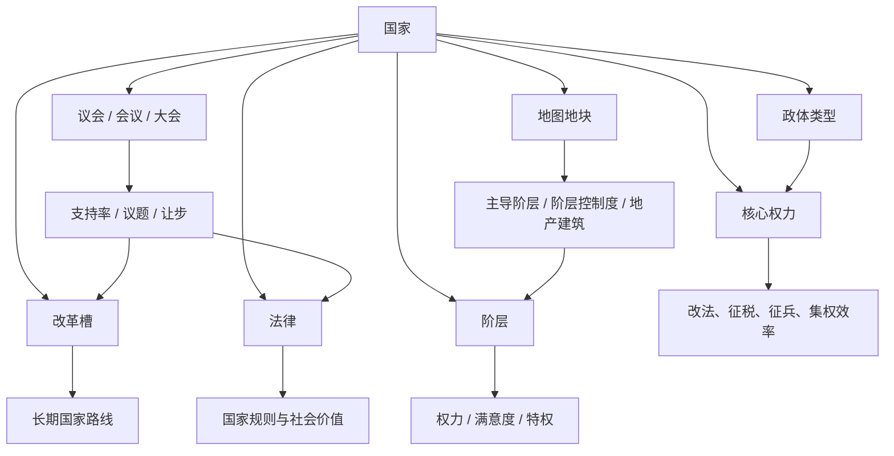

# 01 - 国家、政府、政治与阶层完整设计

结论：本系统不把“政体”做成国家皮肤，而是做成国家机器的底层结构。

**政体决定权力从哪里来，阶层决定权力被谁分享，地图决定权力落在哪里。**

## 设计目标

| 目标 | 说明 |
|---|---|
| 国家有结构 | 国家不是资源面板，而是由政体、法律、改革、阶层和地块共同构成 |
| 政体有差异 | 君主制、共和国、神权国、部族联盟等政体的核心权力不同 |
| 政治有代价 | 改革、征税、征兵、集权、议会都必须改变阶层关系 |
| 阶层落在地图上 | 阶层权力不凭空存在，而来自 POP、建筑、城市、土地、港口和圣地 |
| 可转型 | 政体可以通过改革和决议改变，但不能一键切换 |

## 总体结构

## 核心字段

| 字段 | 含义 | 范围 |
|---|---|---|
| 政体类型 | 国家机器的基本形态 | 君主制、共和国、神权国、部族联盟、商业共和国、帝国制 |
| 核心权力 | 中央能绕过社会集团直接办事的能力 | 0-100 |
| 合法性 | 国家统治被承认的程度 | 0-100 |
| 国家能力 | 行政、财政、军事三类执行能力 | 0-100 |
| 改革槽 | 国家长期路线 | 行政、财政、军事、宗教、政治、海洋 |
| 法律 | 当前制度规则 | 税法、兵役法、土地法、宗教法、贸易法、继承法 |
| 阶层 | 社会集团 | 每个政体 4-5 个 |
| 阶层权力 | 该阶层能阻挠或推动国家行动的能力 | 0-100 |
| 阶层满意度 | 该阶层对当前统治的接受度 | -5 到 +5 |
| 地块阶层控制度 | 某阶层在地块上的地方影响力 | 0-100 |

## 政体类型

| 政体 | 核心权力 | 默认政治机制 | 主要优势 | 主要风险 |
|---|---|---|---|---|
| 君主制 | 王权 | 王权-阶层拉扯 | 合法性稳定、军事动员强、可走集权 | 贵族权力强，改革易受阻 |
| 共和国 | 议会权威 | 议会表决 | 商业、财政、城市发展强 | 派系扯皮，战争授权困难 |
| 神权国 | 教权 | 教义会议 | 合法性、宗教整合、安抚强 | 宽容低，改革受教士制约 |
| 部族联盟 | 盟约权威 | 部族大会 | 动员快、边疆适应强、低治理成本 | 法律弱、财政弱、长期转型困难 |
| 商业共和国 | 商贸权威 | 商人议会 | 港口、市场、舰队、贷款强 | 内陆控制弱，寡头化风险高 |
| 帝国制 | 帝国权威 | 宫廷 + 诸侯体系 | 大国整合、附庸、国际威望强 | 地方割据、宫廷危机、继承风险 |

## 政体与阶层

每个政体使用同一套底层字段：权力、满意度、特权、地图控制度。不同政体只替换阶层名称、诉求和奖励。

| 政体 | 阶层 1 | 阶层 2 | 阶层 3 | 阶层 4 | 特色阶层 |
|---|---|---|---|---|---|
| 君主制 | 贵族 | 商人 | 教会 | 平民 | 王室官僚 |
| 共和国 | 贵族派 | 市民派 | 行会 | 平民 | 议长派系 |
| 神权国 | 教士 | 修会 | 贵族 | 信众 | 圣座使节 |
| 部族联盟 | 氏族 | 战士 | 祭司 | 牧民 | 大可汗/盟主亲族 |
| 商业共和国 | 商社 | 行会 | 港口贵族 | 水手平民 | 寡头家族 |
| 帝国制 | 宫廷 | 诸侯 | 教会 | 城市 | 边疆总督 |

## 核心权力逻辑

| 政体 | 核心权力高 | 核心权力低 |
|---|---|---|
| 君主制 | 改法快、控制力强、贵族不满 | 地方稳定、贵族支持、改革慢 |
| 共和国 | 议案通过快、财政透明、派系不满 | 派系自治、议会扯皮、地方收益高 |
| 神权国 | 宗教统一强、合法性高、异端压力高 | 地方教团强、宽容更高、中央教令弱 |
| 部族联盟 | 动员快、战争强、氏族不满 | 氏族自治、长期稳定、国家能力弱 |
| 商业共和国 | 市场调度强、港口收益高、寡头不满 | 商社自治、远贸灵活、国家控制弱 |
| 帝国制 | 整合强、附庸听令、宫廷斗争高 | 诸侯自治、边疆稳定、帝国行动迟缓 |

## 改革槽

改革槽是国家长期路线。改革不是单纯加成，而是改变政体未来可能性。

| 改革槽 | 影响 | 典型改革 |
|---|---|---|
| 行政改革 | 控制力、整合、官员行动、地方自治 | 巡回法庭、常设官僚、总督区、地方议会 |
| 财政改革 | 税收、市场、债务、货币、商人权力 | 统一税制、关税局、国债、中央银行 |
| 军事改革 | 征兵、常备军、补给、贵族/战士权力 | 封建军役、职业军队、征召体系、海军部 |
| 宗教改革 | 合法性、文化整合、异端、教会权力 | 国教制度、宗教宽容、修会学校、宗教审判 |
| 政治改革 | 政体路线、议会、集权/分权 | 王室集权、等级会议、议会主权、共和宪章 |
| 海洋改革 | 港口、舰队、海外贸易、殖民路线 | 海军委员会、远洋宪章、贸易公司、海峡管控 |

## 法律

法律是当前制度规则。改革槽决定能解锁哪些法律，阶层决定法律能不能推行。

| 法律类型 | 示例 | 影响 |
|---|---|---|
| 土地法 | 贵族地产、王室直辖、自由农地、教会地产 | 控制力、粮食、贵族/平民权力 |
| 税法 | 封建贡赋、城市税、统一税制、关税 | 金钱、商人满意度、平民压力 |
| 兵役法 | 贵族军役、雇佣兵、常备军、普遍征召 | 军需、POP 损耗、贵族权力 |
| 宗教法 | 国教、宽容、宗教审判、教会自治 | 合法性、异教地块、教会权力 |
| 贸易法 | 行会垄断、自由贸易、港口特许、国家商社 | 市场收益、商人/行会权力 |
| 继承法 | 分封继承、长子继承、选举君主、议会确认 | 稳定、继承危机、贵族影响 |

## 议会、会议与大会

议会不是单一系统，而是政体的政治谈判界面。

| 政体 | 议会形态 | 默认状态 |
|---|---|---|
| 君主制 | 等级会议 / 国会 | 改革后解锁 |
| 共和国 | 议会 | 默认拥有 |
| 神权国 | 教义会议 | 默认拥有 |
| 部族联盟 | 部族大会 | 默认拥有 |
| 商业共和国 | 商人议会 | 默认拥有 |
| 帝国制 | 帝国会议 | 默认拥有，但效率低 |

| 玩家想做 | 需要支持 | 可能让步 |
|---|---|---|
| 改法律 | 核心权力或议会多数 | 给阶层特权、降低税、分封地产 |
| 加税 | 商人、市民、贵族或宫廷支持 | 市场特权、自治权、官职 |
| 征兵 | 贵族、战士、平民支持 | 战后封赏、降低劳役、军功特权 |
| 政体改革 | 多阶层支持 + 改革槽条件 | 牺牲旧制度收益 |
| 战争授权 | 军事阶层或议会多数 | 战后土地、贸易权、宗教目标 |

## 地图-阶层绑定

每个地块新增政治字段。

| 字段 | 含义 |
|---|---|
| 主导阶层 | 当前地块实际被哪个阶层影响 |
| 阶层控制度 | 主导阶层在该地块的地方控制强度 |
| 地产建筑 | 让阶层控制固定化的建筑或组织 |
| 地方诉求 | 地块根据阶层、POP、宗教、文化产生的政治要求 |

| 地块类型 | 君主制 | 共和国 | 神权国 | 部族联盟 | 商业共和国 | 帝国制 |
|---|---|---|---|---|---|---|
| 农田 | 农民 / 贵族 | 平民 / 地主派 | 信众 / 教会地产 | 牧民 / 氏族 | 平民 / 行会农庄 | 诸侯 / 农民 |
| 城市 | 商人 | 市民派 / 行会 | 教会学校 / 商人 | 商旅氏族 | 商社 / 行会 | 城市 / 宫廷 |
| 要塞 | 贵族 | 贵族派 / 军事派 | 修会 | 战士 | 港口贵族 | 诸侯 / 边疆总督 |
| 教堂 | 教会 | 教士派 | 教士核心 | 祭司 | 教士 / 行会 | 教会 |
| 港口 | 商人 | 商业派 | 朝圣港 / 商人 | 商路氏族 | 商社核心 | 城市 / 海军官僚 |
| 边疆 | 贵族 / 农民 | 军事派 | 修会 / 信众 | 氏族核心 | 商社据点 | 边疆总督 |

## 地产建筑

地产建筑会把阶层权力固定在地图上。

| 地产 | 适用地块 | 效果 | 风险 |
|---|---|---|---|
| 贵族庄园 | 农田、丘陵、要塞 | 军事产出、地方控制 | 王权下降、改革阻力 |
| 商人行会 | 城市、港口 | 金钱、市场接入 | 商人权力上升 |
| 教会地产 | 教堂、农田、城市 | 合法性、安抚、教育 | 宗教改革困难 |
| 自由农社 | 农田、平原 | 粮食、POP 成长 | 贵族不满 |
| 部族营地 | 草原、边疆 | 动员、移动、低维护 | 财政弱、法律难推 |
| 商社据点 | 港口、海域邻接城市 | 贸易、舰队、贷款 | 寡头化、平民不满 |
| 总督府 | 边疆、征服地 | 控制力、整合 | 地方割据、叛乱 |

## 政体变更

政体变更必须通过改革 + 决议实现。

| 变更 | 条件 | 结果 |
|---|---|---|
| 君主制 → 专制君主制 | 王权高、政治改革偏集权、贵族权力被压制 | 王权行动强，议会关闭或弱化，叛乱风险高 |
| 君主制 → 君主立宪 | 政治改革解锁议会，商人/平民权力上升，合法性稳定 | 议会机制开启，王权下降，长期稳定增强 |
| 君主制 → 共和国 | 王权低、议会强、继承危机或城市权力高 | 进入共和国，贵族与市民派重组 |
| 共和国 → 寡头共和国 | 商社/贵族派权力过高，平民低满意 | 财政强，平民动乱风险高 |
| 共和国 → 君主制 | 议会权威低、军事派强、危机中拥立执政官 | 获得王权，失去部分商业制度 |
| 神权国 → 世俗君主制 | 教权下降、贵族或官僚强、宗教改革完成 | 合法性结构改变，教会权力下降 |
| 部族联盟 → 封建君主制 | 定居地块增加、行政改革达标、氏族满意 | 获得法律和税制，失去部分机动优势 |
| 部族联盟 → 军事联盟 | 战士权力高、战争胜利多 | 军事强，财政和整合弱 |
| 商业共和国 → 海洋帝国 | 海洋改革高、港口网络强、舰队强 | 海外收益强，内陆控制弱 |
| 帝国制 → 联邦帝国 | 诸侯权力高、帝国会议强 | 稳定高，行动慢 |
| 帝国制 → 中央帝国 | 帝国权威高、总督府强 | 整合强，边疆叛乱高 |

## 政治回合

每个时代回合按固定顺序结算。

| 阶段 | 内容 |
|---|---|
| 1. 地图结算 | 地块产出、POP、建筑、控制力、市场接入 |
| 2. 阶层生成权力 | 根据 POP、地产、法律、建筑计算阶层权力 |
| 3. 阶层提出诉求 | 高权力或低满意阶层提出要求 |
| 4. 玩家行动 | 改法、改革、建设、征兵、外交、安抚、压制 |
| 5. 议会/会议 | 若触发议题，玩家用让步换支持 |
| 6. 危机检查 | 低合法性、低满意、低控制力触发危机 |
| 7. 时代推进 | 改革槽进度、政体路线、事件变化 |

## 胜负压力

| 风险 | 来源 |
|---|---|
| 合法性崩溃 | 核心权力过低、继承危机、宗教冲突、议会反对 |
| 阶层叛乱 | 阶层满意度过低，且地图控制度高 |
| 地方割据 | 边疆/贵族/总督控制度高，中央权力低 |
| 寡头化 | 商业阶层权力过高，平民低满意 |
| 神权僵化 | 教权高、革新低、异端地块多 |
| 部族分裂 | 盟约权威低、氏族权力高、战利品不足 |

## 本系统的设计原则

**国家强大不是因为所有数值都高，而是因为玩家知道该让谁付出代价。**
