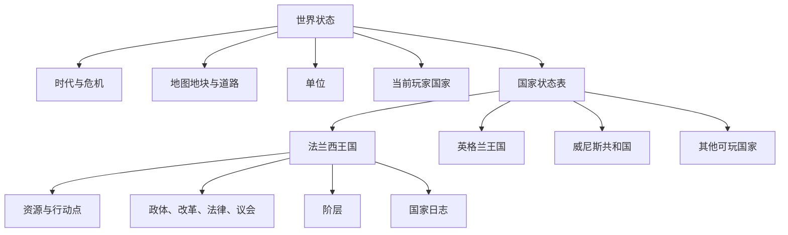

# 02 - 政体地图与国家切换设计

结论：国家切换不是替换国旗，而是把玩家控制权切换到另一套持续存在的国家状态。

## 设计目标

| 目标 | 规则 |
|---|---|
| 政体可读 | 地图可以按国家当前政体着色 |
| 开局可选国 | 新战役开始前选择扮演国家 |
| 游戏中可切国 | 点击当前国家详情中的“切换国家”，免费切换 |
| 国家数据独立 | 各国分别保存资源、行动点、政体、改革、阶层和日志 |
| 世界连续 | 切换国家不重置地图、道路、城市、POP、单位和时代 |
| 权限明确 | 玩家只能操作当前国家控制的地块和单位 |

## 数据架构

地块和单位不再记录抽象的“玩家、敌人、中立”，而是记录具体国家。

| 对象 | 字段 | 说明 |
|---|---|---|
| 世界 | `playerPolity` | 当前玩家控制的国家 |
| 世界 | `countries` | 以国家名为键的独立状态表 |
| 地块 | `controller` | 当前实际控制国 |
| 地块 | `polity` | 1337 年行政或地区标签 |
| 单位 | `owner` | 单位所属的具体国家 |

英属加斯科涅保留为地图行政标签，但主权和控制权归英格兰王国，不作为独立可玩国家。

## 政体地图模式

右下角新增“政体”按钮。地块根据控制国的当前政体着色。

| 政体 | 颜色 |
|---|---|
| 君主制 | 王室蓝 |
| 共和国 | 城邦青 |
| 神权国 | 教会紫 |
| 部族联盟 | 草原绿 |
| 商业共和国 | 商贸金 |
| 帝国制 | 帝国红 |
| 海域 | 海蓝 |

规则：

- 政体来源于国家状态，不能通过国名即时猜测。
- 国家完成政体改革后，地图颜色立即变化。
- 图例只展示政体类型，不罗列所有国家。
- 当前玩家国家的地块保留醒目的金色边界。

## 国家选择

国家选择界面同时服务于开局和游戏中切换。

| 内容 | 展示 |
|---|---|
| 国家标识 | 国旗、名称、首都 |
| 国家结构 | 政体、核心权力 |
| 地图基础 | 地块数、城市数、总 POP |
| 选择操作 | 单选国家后确认 |

国家较多，因此选择界面提供搜索。第一次进入 Demo 时必须先确认国家；游戏中从当前国家详情进入时可以取消。

## 游戏中切换

1. 点击左上角当前国旗。
2. 在当前国家详情中点击“切换国家”。
3. 选择另一个国家并确认。
4. HUD、国家抽屉、资源、改革、阶层和日志切换到新国家。
5. 清除已选单位，选中新国家首都，并把地图中心移动到首都。

切换免费，不消耗行动点，不推进时代，不修改任何国家已有进度。

外国地块详情中的国家旗帜仍然只打开只读详情，不能直接切换。

## 独立国家状态

每个国家保存：

- 粮食、金钱、军需、合法性与行动点
- 当前政体和核心权力
- 六类改革、法律与议会状态
- 该政体对应的阶层权力、满意度和特权
- 本国行动日志

初始资源从该国现有地块、POP、建筑和港口推导，避免为每个国家手工填写无来源数值。

## 时代结算

“结束时代”属于世界级操作。

| 当前国家 | 非当前国家 |
|---|---|
| 结算产出、军队维护、低控制力和危机 | 结算产出、军队维护和低控制力 |
| 行动点恢复 | 行动点恢复 |
| 检查玩家失败条件 | 暂不触发主动改革、战争或终局 |

非玩家国家暂不执行策略 AI，只进行确定性结算。以后增加 AI 时可以直接写入各自国家状态，不需要再次重构数据结构。

## 初始政体

每个可玩国家必须显式配置初始政体。代表性配置如下：

| 国家 | 初始政体 |
|---|---|
| 法兰西、英格兰、卡斯蒂利亚等王国 | 君主制 |
| 威尼斯 | 商业共和国 |
| 诺夫哥罗德 | 共和国 |
| 教皇国、条顿骑士团 | 神权国 |
| 神圣罗马帝国、拜占庭帝国 | 帝国制 |
| 金帐汗国 | 部族联盟 |

## 验收标准

| 场景 | 预期 |
|---|---|
| 切到英格兰再切回法兰西 | 两国资源和政治数据互不覆盖 |
| 切到威尼斯 | HUD 显示威尼斯数据，政体为商业共和国 |
| 政体地图模式 | 同政体国家同色，改革后立即改色 |
| 点击外国地块国旗 | 只能查看，不能操作或直接切换 |
| 切换国家 | 地图定位首都，单位选择清空 |
| 结束时代 | 所有国家完成基础结算，各自行动点恢复 |
