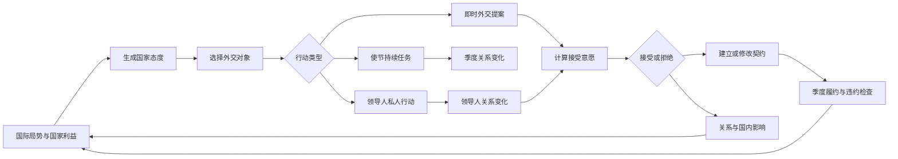

# 04 - 国家外交系统设计

结论：外交系统可以进入 Demo 开发。

首版不应把外交做成“点击按钮刷好感”，而应建立一套可解释的国家关系模型：国家根据利益形成态度，玩家通过使节、提案和领导人行动改变条件，最终建立或破坏具有实际义务的外交契约。

**国家态度描述彼此怎么看，外交契约描述彼此承诺什么，权利结构描述谁能命令谁，领导人关系提供短期机会。**

## 设计目标

| 目标 | 规则 |
|---|---|
| 关系可解释 | 所有态度和提案结果都能追溯到底层因素 |
| 国家有利益 | 外国不会因为单纯刷关系而接受损害自身的条约 |
| 人物有作用 | 领导人可以打开短期窗口，但不能替代国家正式契约 |
| 从属有层次 | 朝贡、附庸、傀儡等关系由类型与具体权限共同定义 |
| 组织独立存在 | 帝国诸侯是组织成员，不直接等同于宗主国的附庸 |
| 外交有成本 | 即时行动消耗外交点，持续任务占用使节，长期承诺占用外交容量 |
| 结果影响全局 | 外交会改变战争、市场、阶层、继承、地图通行和国家合法性 |

## 总体流程



## 四层外交关系

| 层级 | 解决的问题 | 示例 |
|---|---|---|
| 国家态度 | 双方目前如何看待彼此 | 亲近、合作、中立、警惕、竞争、敌对 |
| 外交契约 | 平等国家承诺了什么 | 同盟、联姻、贸易协定、军事通行、停战 |
| 权利结构 | 国家之间是否存在支配关系 | 朝贡、附庸、傀儡、共主邦联、边疆属国 |
| 国际组织 | 国家是否属于共同政治体系 | 帝国诸侯、选帝侯、自由市、宗教联盟 |

四层可以同时存在。例如：

> 勃兰登堡可以敌视巴伐利亚、同属神圣罗马帝国、与波希米亚联姻，并在某场战争中接受皇帝调停。

## 国家关系数据

每一对国家共享一份双边关系记录。方向性数据必须分别保存，不能假设双方感受相同。

| 字段 | 范围 | 是否有方向 | 主要来源 |
|---|---:|---|---|
| 信任 | 0-100 | 是 | 履约、共同作战、长期和平、违约 |
| 威胁 | 0-100 | 是 | 扩张、边境驻军、国力差距、侵略记录 |
| 恩义 | -100 至 100 | 是 | 援助、保护、出兵、债务与回报 |
| 领土矛盾 | 0-100 | 是 | 核心领土、宣称、边境争端 |
| 制度冲突 | 0-100 | 是 | 宗教、政体、组织和继承冲突 |
| 战略利益 | -100 至 100 | 是 | 共同敌人、贸易、地缘目标、海峡与市场 |

关系记录还应引用：

- 当前正式契约。
- 当前从属契约。
- 共同国际组织。
- 停战期限和战争状态。
- 两国现任领导人的私人关系。
- 最近发生的重大外交事件。

### 历史数据边界

1337 年开局数据分成两类：

| 类型 | 处理方式 |
|---|---|
| 历史事实 | 战争、停战、联姻、从属、帝国成员、明确宣称等必须有史料依据 |
| 模拟数值 | 信任、威胁、战略利益等由历史事实和地图局势通过统一规则计算 |

不能直接手填一批看似合理的关系数值。每项历史事实应记录来源说明；缺少依据的关系不进入开局数据，等规则在游戏过程中生成。

## 国家态度

主态度完全由底层关系自动生成。玩家不能直接修改“友好”或“敌对”标签。

| 主态度 | 典型条件 | 行为倾向 |
|---|---|---|
| 亲近 | 高信任、低威胁、利益高度一致 | 联盟、联姻、共同防御 |
| 合作 | 存在明确共同利益 | 贸易、通行、有限援助 |
| 中立 | 没有明显利益或矛盾 | 建交、试探、改善关系 |
| 警惕 | 威胁升高但尚未形成直接敌意 | 保证独立、寻找制衡者 |
| 竞争 | 地缘目标冲突或争夺影响力 | 禁运、拉拢盟友、代理竞争 |
| 敌对 | 高矛盾、高威胁、低信任 | 最后通牒、颠覆、战争准备 |

正式关系不覆盖主态度：

- 盟友仍可能因领土争端而互相警惕。
- 附庸可以亲近宗主，也可以敌视宗主。
- 同一国际组织的成员可以竞争甚至在规则允许时交战。

## 外交资源

| 资源 | 来源 | 用途 |
|---|---|---|
| 外交行动点 | 领导人外交能力，每季度恢复 | 提交条约、赠礼、威慑、修改从属条款 |
| 使节 | 国家基础值、改革、政体和领导人能力 | 执行改善关系、建立情报网、拉拢阶层等持续任务 |
| 外交容量 | 国家规模、政体、改革、领导人和国际地位 | 维持联盟、保证独立、附属控制等长期承诺 |

外交容量超出后不禁止继续签约，但会产生可见代价：

- 外交行动点恢复下降。
- 盟友信任逐季下降。
- 附属国忠诚度下降。
- 国内阶层对外交负担产生意见。

## 外交行动

### 即时提案

| 行动 | 基础条件 | 主要结果 |
|---|---|---|
| 赠礼 | 有足够金钱与外交点 | 提高信任，可能提高对方领导人好感 |
| 贸易协定 | 双方未禁运且市场存在连接 | 增加战略利益与贸易收入 |
| 军事通行 | 未处于战争且对方愿意承担风险 | 开放军队通行 |
| 王室联姻 | 双方制度、宗教和继承法允许 | 建立家族联系与继承风险 |
| 互不侵犯 | 双方没有立即战争计划 | 降低威胁并限制宣战 |
| 防御同盟 | 高信任且存在共同威胁 | 一方受攻击时产生参战义务 |
| 进攻同盟 | 高信任且战略目标一致 | 可邀请盟友参加主动战争 |
| 保证独立 | 保证方拥有足够国力和容量 | 被保证国受攻击时产生干预义务 |
| 最后通牒 | 有明确要求与实力优势 | 接受条件或给予战争借口 |
| 修改从属条款 | 存在从属关系 | 改变附属国权限、贡赋和义务 |

### 持续任务

| 任务 | 每季度影响 | 终止条件 |
|---|---|---|
| 改善关系 | 缓慢提高信任、降低威胁 | 撤回使节、战争爆发、达到上限 |
| 建立情报网 | 解锁对方军力、继承和国内政治信息 | 被发现、撤回使节 |
| 拉拢阶层 | 提高对方某阶层对本国的好感 | 被发现、目标阶层失势 |
| 争夺影响力 | 增加战略竞争并削弱第三国影响 | 撤回使节或目标退出地区 |
| 安抚附属国 | 提高现实忠诚度 | 撤回使节 |
| 推动组织议案 | 提高本国议案支持度 | 议案表决结束 |

### 施压与操纵

| 行动 | 即时收益 | 主要代价 |
|---|---|---|
| 威胁 | 提高短期接受意愿 | 增加威胁与宿怨 |
| 禁运 | 削弱对方贸易 | 伤害双方商人利益 |
| 支持叛乱 | 削弱对方稳定 | 被发现后给予对方战争借口 |
| 支持继承人 | 换代后获得关系优势 | 加剧宫廷和家族冲突 |
| 策动附属国 | 降低目标对宗主的忠诚 | 与宗主关系恶化 |
| 索取贡赋 | 获得定期收入 | 附属国忠诚下降 |

## 提案接受意愿

外交提案使用可预判的确定性结算，不使用隐藏随机成功率。

```text
接受意愿 =
对方直接收益
+ 战略利益
+ 国家关系修正
+ 领导人关系修正
+ 共同威胁
+ 国内支持
- 条约成本
- 主权损失
- 对提案方的威胁
- 现有契约冲突
```

| 结果 | 规则 |
|---|---|
| 接受 | 接受意愿达到门槛，双方立即建立正式契约 |
| 拒绝 | 不消耗全部提案成本，但会形成短期“近期拒绝”修正 |
| 可谈判 | 接近门槛时，对方提出金钱、领土、贡赋或条款交换 |
| 不可提交 | 与现有契约、停战或制度规则直接冲突 |

玩家在确认前必须看到每项主要修正及最终结果，避免盲猜。

## 领导人外交

国家关系与领导人私人关系分开保存。

| 私人关系 | 作用 |
|---|---|
| 友谊 | 提高合作型提案接受意愿 |
| 亲属 | 支持联姻、继承与家族外交 |
| 尊重 | 提高会晤、调停和共同宣言效果 |
| 恐惧 | 提高屈服型提案的短期接受意愿 |
| 宿怨 | 降低合作意愿，提高威慑和冲突升级风险 |
| 私人承诺 | 临时提高某个具体提案的接受意愿 |

| 领导人行动 | 条件 | 影响 |
|---|---|---|
| 私人会晤 | 双方未处于战争 | 增加尊重或友谊 |
| 王室联姻 | 制度与继承法允许 | 建立亲属关系和继承联系 |
| 私人赠礼 | 消耗金钱与外交点 | 改善私人关系，可能引起国内不满 |
| 公开威慑 | 国力或军事能力占优 | 增加恐惧和宿怨 |
| 私人承诺 | 私人关系良好 | 临时修正一个正式提案 |
| 拉拢继承人 | 拥有使节和情报条件 | 下一次换代后获得关系优势 |

换代规则：

- 友谊、尊重、恐惧和宿怨逐步衰减。
- 亲属关系由家族谱系保留。
- 私人承诺通常随领导人离任失效。
- 正式国家契约继续存在并接受新领导人重新评估。

## 不平等国家关系

不平等关系使用“从属类型 + 自主权条款”，并同时记录法定自主权与现实忠诚度。

| 数据 | 含义 |
|---|---|
| 法定自主权 | 契约允许附属国自行处理多少事务 |
| 现实忠诚度 | 附属国是否愿意履行契约 |

这两个数值不能合并。高自主国家可以忠诚，低自主傀儡也可能准备独立。

### 从属类型

| 类型 | 核心性质 | 默认倾向 |
|---|---|---|
| 朝贡国 | 以贡赋换取承认或保护 | 高外交自主、低军事义务 |
| 附庸国 | 承认宗主权并承担有限义务 | 中等自主、按契约参战 |
| 傀儡国 | 宗主控制其对外政策 | 低外交自主、强制参战 |
| 共主邦联 | 多国由同一领导人统治 | 内政独立、外交部分绑定 |
| 边疆属国 | 以边境防务换取内部自治 | 高军事义务、较低贡赋 |

### 自主权条款

| 条款 | 可配置内容 |
|---|---|
| 独立外交 | 完全独立、需宗主批准、禁止独立外交 |
| 宣战权 | 自由宣战、仅可防御、需宗主批准 |
| 军事义务 | 不参战、防御参战、应召参战、强制参战 |
| 财政贡赋 | 无、固定贡赋、收入比例、临时征收 |
| 市场归属 | 独立市场、优先宗主市场、强制并入 |
| 继承与任命 | 独立继承、宗主确认、宗主任命 |

### 忠诚度变化

| 提高忠诚 | 降低忠诚 |
|---|---|
| 宗主保护、减轻贡赋、领导人友谊、共同敌人 | 提高贡赋、干涉继承、宗主战败、阶层被压制 |

忠诚度过低时，附属国会拒绝履约、寻找支持者、要求提高自治或发动独立战争。

## 国际组织

国际组织是国家之间的多边规则，不属于普通附属关系。

以神圣罗马帝国为例：

| 身份 | 权利 | 义务 |
|---|---|---|
| 普通诸侯 | 内政独立、按帝国法进行有限战争 | 遵守帝国法、承担帝国防务 |
| 选帝侯 | 参与选举皇帝 | 维护选举制度 |
| 自由市 | 获得皇帝保护与贸易特权 | 纳税并支持帝国机构 |
| 皇帝 | 推动改革、调停争端、执行帝国禁令 | 保护成员并处理非法战争 |

组织需要独立记录：

- 成员身份与特殊职位。
- 组织法律和改革。
- 共同防务义务。
- 成员间战争规则。
- 议案、投票与执行结果。
- 组织权威及成员服从度。

## 契约生命周期

每份外交契约记录：

`生效时间、最短期限、双方义务、退出条件、违约惩罚、是否自动续约`

| 结束方式 | 结果 |
|---|---|
| 到期不续约 | 通常无惩罚 |
| 按条款提前退出 | 消耗外交点并少量降低信任 |
| 双方协商解除 | 双方接受后解除，代价最低 |
| 单方面撕毁 | 立即解除，大幅降低信任并给予对方外交借口 |
| 拒绝履行义务 | 契约暂时保留，产生违约记录并触发后续事件 |

## 国内政治影响

外交行动需要接入现有政体、阶层和领导人系统。

| 外交行为 | 可能支持者 | 可能反对者 |
|---|---|---|
| 贸易协定 | 商人、城市、商社 | 受冲击的行会和本地生产者 |
| 王室联姻 | 宫廷、贵族、王室官僚 | 敌对家族、宗教集团 |
| 主动战争同盟 | 战士、贵族、边疆集团 | 平民、商人、议会反战派 |
| 向外国屈服 | 求稳阶层 | 军事贵族、民族与宗教集团 |
| 提高附属贡赋 | 宗主官僚、商人 | 附属国全部受损阶层 |
| 放宽附属自治 | 附属国地方阶层 | 宗主中央集权派 |

政体决定外交授权方式：

- 君主制可以由君主直接处理多数外交，但重大让步可能损害合法性。
- 共和国的同盟、战争与从属条款可能需要议会批准。
- 商业共和国更容易通过贸易协定，但商社会反对损害市场的战争。
- 帝国制擅长管理附属关系，但需要承担更高外交容量和保护义务。
- 神权国受宗教合法性和教士态度约束。
- 部族联盟的重要外交承诺需要部族大会支持。

## 季度结算

每回合为一个季度，按以下顺序结算：

1. 使节持续任务。
2. 条约义务、贡赋和援军。
3. 外交容量及超额惩罚。
4. 契约违约检查。
5. 附属国忠诚度与自治要求。
6. 领导人私人关系衰减。
7. 国家关系底层数据更新。
8. 重新生成主态度。
9. 检查外交事件、最后通牒和战争借口。

## Demo 开发评估

### 当前基础

| 已有能力 | 对外交系统的价值 |
|---|---|
| 独立国家状态表 | 可直接给每个国家保存外交资源和外交目标 |
| 国家切换 | 能从不同国家视角验证同一份双边关系 |
| 历史领导人和换代 | 可以实现领导人私人关系及换代衰减 |
| 三类行动点 | 外交点已经存在，不需要重做资源体系 |
| 政体、阶层和议会 | 可以承接外交行动的国内支持与反对 |
| 国家详情窗口 | 可以加入关系概览、领导人关系和外交行动入口 |
| 季度循环 | 可以承接使节任务、贡赋、条约和违约结算 |
| 地块与国家归属 | 可以判断边境、领土争端、军事通行和共同威胁 |

### 当前缺口

| 缺口 | 开发要求 |
|---|---|
| 战争关系仍是固定名单 | 改成世界状态中的动态战争与停战记录 |
| 没有双边关系表 | 新增成对国家关系数据，并明确方向性字段 |
| 没有外交契约实体 | 新增条约、从属关系和国际组织三类独立记录 |
| 没有使节和外交容量 | 扩展国家状态与季度结算 |
| 外国行为缺失 | 首版至少需要确定性的提案响应与基础 AI 决策 |
| 1337 年外交事实尚未结构化 | 建立带来源说明的战争、联姻、从属和组织成员数据 |
| 国家详情只有静态关系文字 | 增加外交页签、修正明细、行动和契约查看 |
| 单文件已经较大 | 外交代码必须按数据、计算、命令、渲染四段组织，不能继续散落追加 |

### 可开发结论

**可以开发，现有 Demo 不需要推倒重做。**

但完整外交系统不适合一次性全部加入。首版应先形成一个闭环：

| 首版实现 | 暂缓 |
|---|---|
| 双边关系六项底层数据与自动态度 | 完整多边国际组织改革 |
| 外交点、2 名使节、外交容量 | 复杂秘密外交和间谍事件链 |
| 改善关系持续任务 | 全部历史外交关系考据 |
| 赠礼、贸易、通行、联姻、防御同盟 | 进攻同盟和复杂战争协商 |
| 可解释的提案接受意愿 | 外交谈判中的多轮还价 |
| 契约期限、退出和违约 | 全部从属类型的完整 AI 行为 |
| 领导人会晤与私人关系 | 继承战争和跨国家族谱 |
| 朝贡、附庸、傀儡三种从属关系 | 神圣罗马帝国完整组织玩法 |
| 国家详情中的外交页签 | 独立外交地图模式 |

首版验收标准：

1. 玩家能查看任意两国的态度及形成原因。
2. 玩家能派遣使节，并看到关系按季度变化。
3. 玩家能提交外交提案，并在确认前看到接受意愿明细。
4. 条约建立后能产生真实效果、占用容量并按季度履约。
5. 领导人换代会改变私人关系，但不会直接删除国家契约。
6. 从属国的自主权与忠诚度会影响其履约和反抗。
7. 切换国家后，同一外交关系从另一方视角仍然一致。

## 与其他设计文档的关系

- [[01-国家政府政治阶层完整设计]]
- [[02-政体地图与国家切换设计]]
- [[03-国家领导人机制设计]]

下一阶段应先编写外交 Demo 实现方案，再修改 `prototype/demos/帝国的代价-微信小游戏demo.html`。
