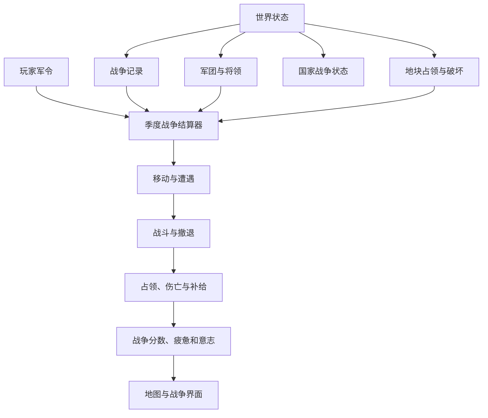

# 07 - 战争系统 Demo 改造方案

结论：现有 Demo 可以改造，但不能直接叠加完整战争系统。应先替换当前简陋的单位移动与占领逻辑，完成“陆军军团、季度军令、逐格移动、战斗、占领、战争状态、基础和平”的可玩闭环，再扩展补给、围城、POP 伤亡和海军。

## 现状评估

当前主文件：

`prototype/demos/帝国的代价-微信小游戏demo.html`

规模约 6052 行、317 KB，使用原生 HTML、CSS、JavaScript 和 SVG，所有系统都在单文件中。

| 现有能力 | 可复用程度 | 说明 |
|---|---|---|
| 真实地图与六边格 | 高 | 已有地块、邻接、地形、道路、城市、港口和要塞 |
| 国家独立状态 | 高 | `state.countries` 已保存资源、领导人、政体和阶层 |
| 动态外交战争 | 中 | `state.diplomacy.wars` 已能判断交战，但缺少战争目标和战争状态 |
| 季度结算 | 高 | `endTurn()` 已统一推进国家、外交和领导人 |
| 单位系统 | 低 | 单位只有 `army/admin/fleet`，没有军团状态和编制 |
| 移动系统 | 低 | 陆军每次只移动相邻一格，并即时消耗军事点 |
| 战斗系统 | 必须替换 | 进入敌军地块后直接删除一支敌军，没有结算过程 |
| 占领系统 | 必须替换 | 军队进入后立即把 `controller` 改为进攻方，混淆法定归属与军事占领 |
| POP 与产出 | 高 | 已有 POP、地块产出和阶层，可承接征兵与战争破坏 |
| 地图交互 | 中 | 点击、拖动、缩放已成熟，但军团路线需要新增交互状态 |
| 自动化测试 | 中 | 已有 Node.js 测试目录，可增加纯逻辑测试 |

## 必须先纠正的底层问题

| 当前逻辑 | 问题 | 改造 |
|---|---|---|
| `tile.units` 保存简单单位 | 无法表达军团编制、士气和组织度 | 世界状态新增独立 `armies` 表，地块只保存军团位置引用 |
| 点击相邻格立即移动 | 与季度同时军令冲突 | 点击只规划路线，结束季度时统一执行 |
| 遇敌后直接删除敌军 | 无兵力、士气、经验和撤退 | 改为独立战斗结算 |
| 进入敌地立即修改 `controller` | 把占领等同于领土归属 | 保留 `polity/controller`，新增 `occupier` 和 `occupation` |
| 每支军队只消耗一份粮食 | 无法体现规模和兵种 | 按军团兵力、炮兵比例和行动计算维护 |
| 军事点直接控制每次移动 | 导致微操且无法同时结算 | 军事点用于招募、动员、训练和特殊军令，不为每格移动付费 |

## 推荐架构

继续保留单文件运行形式，但在脚本内部按职责划分区域，不立即拆成构建工程。



### 世界状态扩展

```javascript
state.warfare = {
  nextArmyId: 1,
  nextBattleId: 1,
  armies: {},
  generals: {},
  orders: {},
  battles: [],
  prisoners: [],
  pendingPeace: null
};
```

### 战争记录扩展

现有 `state.diplomacy.wars` 保留为战争事实的唯一来源，并增加：

```javascript
{
  id,
  name,
  attackers,
  defenders,
  warLeaderAttack,
  warLeaderDefense,
  primaryGoal,
  secondaryDemands,
  startedTurn,
  score,
  participants: {
    "法兰西王国": {
      side: "defender",
      contribution: 0,
      warWill: 85
    }
  }
}
```

### 国家战争状态

```javascript
country.warfare = {
  warExhaustion: 0,
  mobilizationLaw: "limited",
  reinforcementPriority: [],
  supplyPriority: [],
  availableGenerals: []
};
```

### 军团数据

```javascript
{
  id,
  owner,
  tileId,
  name,
  units: [
    {
      combatType: "infantry",
      serviceType: "levy",
      soldiers: 1000,
      sourceTileId,
      sourceEstate: "peasants",
      experience: 0
    }
  ],
  generalId: null,
  morale: 100,
  organization: 100,
  supply: 100,
  status: "ready",
  plannedPath: [],
  order: "hold"
}
```

`combatType` 只允许 `infantry`、`cavalry`、`artillery`。炮兵由后期科技解锁。

`serviceType` 只允许 `guard`、`professional`、`standing`、`levy`、`mercenary`。

## 季度结算顺序

结算顺序必须固定，避免同一结果由不同模块重复修改。


第一版可以将补给简化为“是否连接己方城市”，但数据字段与结算位置必须按完整架构建立，避免后续重写。

## 界面改造

### 左上入口

新增“军事”按钮，位于“外交”之后。军事抽屉包含：

| 页签 | 内容 |
|---|---|
| 军团 | 本国军团列表、状态、位置和当前军令 |
| 动员 | 按地区和阶层征召步兵、骑兵 |
| 佣兵 | 可招募佣兵团 |
| 战争 | 当前战争、目标、分数、意志、疲惫和参战国 |

### 地图交互

1. 点击己方军团，打开左下军团详情抽屉。
2. 地图高亮可规划的路径与移动成本。
3. 点击目标地块只写入 `plannedPath`，不立即移动。
4. 敌方控制区、不可通行地块和补给风险使用边界或图标提示。
5. 结束季度后播放简短移动与战斗结果，不增加独立战术画面。

### 军团详情

军团详情应展示：

- 军团名称、所属国家、位置。
- 步兵、骑兵、炮兵数量。
- 核心卫队、职业军团、常备军、征召兵、雇佣兵构成。
- 士气、组织度、补给和经验。
- 将领与三项能力。
- 路线、军令、拆分、合并、训练和撤退操作。

### 战争窗口

战争窗口展示：

- 双方阵营与战争领袖。
- 主战争目标和次要要求。
- 当前战争分数。
- 各国战争意志、战争疲惫和贡献。
- 关键战役、占领目标与封锁。
- 提议和平按钮。

### 地图模式

首版新增两个地图模式：

| 模式 | 内容 |
|---|---|
| 军事控制 | 法定领土色为底，叠加占领纹理和控制区 |
| 补给 | 显示补给源、可达路线、危险节点和断供军团 |

## 分阶段开发

### 第一阶段：陆战最小闭环

目标：玩家能规划路线，并在结束季度后看到两支军团发生可解释的战斗。

| 开发内容 | 验收标准 |
|---|---|
| 军团数据 | 军团包含步兵、骑兵、士气、组织度和经验 |
| 军令队列 | 点击地图只规划路线，不立即移动 |
| 地形移动 | 平原、森林、丘陵、山地拥有不同移动成本 |
| 遭遇战 | 双方争夺同一格时生成战斗 |
| 战斗结果 | 产生伤亡、士气变化、撤退与战斗报告 |
| 占领分离 | 使用 `occupier`，不修改法定归属 |

### 第二阶段：战争国家闭环

目标：战斗结果能够推动战争结束。

| 开发内容 | 验收标准 |
|---|---|
| 战争目标 | 百年战争拥有明确主目标 |
| 战争分数 | 目标、战役和占领改变分数 |
| 战争意志 | 每个参战国独立变化 |
| 战争疲惫 | 伤亡、占领和持续时间产生国家压力 |
| 基础和平 | 可以割让目标地块、赔款或维持现状 |
| 停战 | 和平后从战争状态移除并建立停战 |

### 第三阶段：征兵与 POP

目标：军队不再凭空生成，战争能伤害国家底层。

| 开发内容 | 验收标准 |
|---|---|
| 阶层动员 | 贵族、农民、市民提供不同兵源 |
| POP 扣除 | 动员减少来源地块可生产人口 |
| 补员 | 从来源 POP 补充军团 |
| 伤亡回写 | 死亡和永久伤残减少 POP |
| 复员 | 幸存征召兵返回来源地块 |
| 阶层反馈 | 动员深度影响对应阶层满意度 |

### 第四阶段：补给、要塞与破坏

目标：地图纵深、城市和要塞成为战略对象。

| 开发内容 | 验收标准 |
|---|---|
| 自动补给线 | 军团连接首都、城市或港口 |
| 补给不足 | 降低组织度并产生非战斗减员 |
| 控制区 | 敌军和要塞限制绕行 |
| 围城进度 | 要塞不能被进入后立即占领 |
| 地块破坏 | 围城、劫掠、长期占领影响 POP、建筑和产出 |
| 就地征粮 | 补给收益与地块代价同时发生 |

### 第五阶段：海军与战前危机

目标：完成战争系统总纲，而不是首轮就扩大范围。

| 开发内容 | 说明 |
|---|---|
| 舰队与局部制海权 | 替换当前简单舰队棋子 |
| 海上运输和登陆 | 与陆军军团、港口、海峡连接 |
| 封锁 | 影响贸易、补给、围城和战争分数 |
| 远洋科技 | 新舰船单位解锁远洋格 |
| 战前危机 | 通牒、选边和复杂战争目标 |
| 多边和平 | 贡献、公开要求和单独媾和 |

## 第一轮实际改造范围

推荐第一轮只做：

1. 军团数据结构。
2. 步兵、骑兵两类单位；炮兵保留锁定入口。
3. 军团编制面板。
4. 路线规划与季度统一移动。
5. 地形移动成本。
6. 基础控制区。
7. 遭遇战、伤亡、士气、组织度和撤退。
8. 占领与法定归属分离。
9. 当前战争面板、战争分数、战争意志和战争疲惫。
10. 仅支持维持现状、目标领土、赔款三种和平要求。

这一范围已经能验证战争玩法是否有操作感，不需要同时开发海军、复杂围城、完整 POP 伤亡和战前危机。

## 改造风险

| 风险 | 处理 |
|---|---|
| 单文件继续膨胀 | 首轮仍保留单文件，但以明确模块区组织；战争闭环稳定后再决定是否拆文件 |
| 地图点击与军团路线冲突 | 新增明确的“地块选择/军团规划”交互模式，不能依赖当前选中状态猜测 |
| 多国同时结算顺序偏差 | 使用军令快照和固定阶段结算，任何阶段不得读取尚未锁定的临时 UI 状态 |
| POP、产出重复扣减 | 伤亡先写地块事实，国家疲惫只做汇总，不再次制造损失 |
| 随机结果难理解 | 每场战斗生成阶段报告，列出地形、兵种、组织度、将领和战机事件 |
| 旧存档兼容 | Demo 当前没有正式存档承诺，状态结构直接升级，不编写降级兼容层 |

## 验证清单

| 范围 | 验证 |
|---|---|
| 数据 | 每支军团只有一个位置，单位兵力不能为负 |
| 移动 | 不可通行地形、控制区和移动力限制正确 |
| 同时结算 | 双方同格、交叉移动、多军团增援结果稳定 |
| 战斗 | 相同输入与随机种子得到相同结果 |
| 因果 | 伤亡先影响单位与 POP，再影响疲惫和意志 |
| 和平 | 和平成本不能超过战争分数，领土归属交给宣称方 |
| 回归 | 地图点击、拖动、缩放、国家切换、外交和季度换代不受影响 |
| 代码 | 提取脚本后通过 `node --check`，核心结算使用 Node.js 单元测试 |

## 实施判断

| 结论 | 说明 |
|---|---|
| 是否可开发 | 可以 |
| 是否应一次完成全部设计 | 不应 |
| 第一轮工作量 | 中到大，核心在重写单位移动、战斗和占领 |
| 最大技术风险 | 单文件状态耦合与同时军令结算 |
| 最大玩法风险 | 军令过于自动导致操作感弱，或细节过多拖慢季度节奏 |
| 推荐下一步 | 按第一阶段和第二阶段先做陆战与战争国家闭环 |

## 关联文档

- [[06-战争与和平系统设计]]
- [[05-国家外交系统开发路线图]]
- [[04-国家外交系统设计]]

