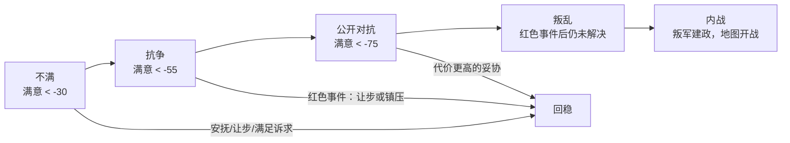

# 09 - 游戏机制完整策划方案（玩法层重构）

结论：**当前 demo 已经建成了一台相当完整的"历史模拟器底盘"，但还没有装上"游戏层"。玩家反馈的三个问题（不知道做什么、不知道为什么输、不想再开一局）不是三个独立缺陷，而是同一个缺陷的三个面：demo 只有系统，没有目标、反馈和成长曲线。**

本方案不推倒任何已有系统，而是在模拟底盘之上补齐游戏层，并重做被证明会制造"死亡螺旋"的数值结构。

---

## 一、现状诊断

### 1.1 已有资产（必须保留）

demo（`prototype/demos/帝国的代价-微信小游戏demo.html`，约 7500 行）实际完成度远高于"原型"一词的预期：

| 模块 | 完成内容 | 评价 |
|---|---|---|
| 地图 | 欧洲+北非+地中海真实轮廓六边格、6 种地图模式、迷雾、缩放 | 成熟，是最大资产 |
| 国家 | 34 个可玩国、1337 年历史领导人、三能力行动点、继承/选举换代 | 成熟 |
| 政治 | 6 政体、阶层（权力/满意度/特权）、6 类改革槽、议会议程、决议 | 结构完整，数值有致命问题 |
| 外交 | 方向性六因素关系、自动态度、使节任务、确定性提案明细、5 类条约、3 类从属 | 设计先进，超过多数同类游戏 |
| 战争 | 军团编制、季度同时军令、ZoC、可解释战斗结算、占领与归属分离、战争分数/意志/疲惫、和谈 | 闭环已通 |
| 结算 | 季度回合、产出推导（地形×气候×POP×建筑×控制力）、冬季危机 | 闭环已通 |
| 测试 | 战争模块 Node.js 单元测试 9 个文件 | 工程习惯好 |

**判断：底盘不需要重做。所有问题都在"玩家与底盘之间的那一层"。**

### 1.2 问题一「玩法不清晰」的机制根源

| 根源 | 代码证据 |
|---|---|
| 全游戏没有任何目标实体 | `checkEnd()` 只有 2 个失败判定，无胜利条件、无任务、无使命、无评分 |
| 没有任何引导 | 全文搜索无教程/引导/帮助类 UI；`start()` 直接进选国界面，确认后玩家面对一张地图 |
| 玩家动词与系统深度错位 | 玩家可点的内政动作只有 6 个地块级小按钮（征兵/行政官/修路/建设/整合/整军经国），每个效果微小（单地块控制力 +10），而外交/战争系统深度极高——新玩家根本走不到那里 |
| 不知道"现在最重要的是什么" | HUD 只有 4 个裸数字（粮/钱/军需/合法性），无趋势、无预警、无建议 |

玩家进入游戏后的真实心理路径：看到漂亮地图 → 点开抽屉看到一堆数字 → 随便点两个按钮 → 不知道有没有用 → 点结束回合 → 几次之后突然弹窗"国家崩溃"。

### 1.3 问题二「操作影响不可见、莫名其妙失败」的机制根源

这是最严重的问题，根源是**三个隐形流失源 + 两个瞬死判定 + 一对互锁钳形**：

**（a）合法性被压在 [-5, +15] 微区间内，且有三个自动流失源**（`normalizeCountry`、`settleCountry`、`CRISES`）：

| 流失源 | 规则 | 玩家可见性 |
|---|---|---|
| 冬季危机 | 每年冬季按年份取模强制触发：继承危机 -2、宗教动荡至多 -3、帝国疲惫至多 -3 | 触发后才有一行日志，事前无任何预告 |
| 低控制地块 | 控制力 <45 的地块每季动乱 +1，动乱 ≥4 后每季合法性 -1 | 完全无提示 |
| 粮食赤字 | 粮食为负时，赤字额**直接全额扣合法性**，同时平民满意 -1 | 一行日志 |

开局合法性 8。仅冬季危机一项，6 年循环固定扣约 8 点——**玩家从第 1 回合起就站在一条看不见的倒计时上**。

**（b）两个瞬死判定，无预警、无中间态、无挽救窗口**（`checkEnd()`）：

- 合法性 ≤ 0 → 弹窗"国家崩溃"，游戏结束；
- 任一阶层满意度 ≤ -5 且权力 ≥ 40 → 弹窗"内乱爆发"，游戏结束。

而贵族开局基础权力就是 **42**（`ESTATE_LIBRARY.nobles.basePower`），满意度区间只有 [-5, +5]。即：对所有君主制国家，**"贵族满意度净 -6"从第 1 回合起就是死刑判决**，且没有任何 UI 告诉玩家这件事。

**（c）钳形互锁：救命药就是毒药。**

- 唯一可重复的合法性恢复手段「整军经国」：+2 合法性，但**每次贵族和教会满意度各 -1**；
- 行政/政治/海洋改革：各扣贵族满意 -1；
- 给贵族回血的唯一办法是建要塞（+1 满意），但同时**+2 权力且地块阶层控制 +10**——把贵族进一步推过权力 40 的内战线；
- 平民满意度**只有 7 个下降渠道，0 个恢复渠道**（征兵、军事改革、议会让步、商贸繁荣危机、粮食赤字……全是减号）。

结论：玩家不动会因合法性归零而死，动起来会因阶层崩溃而死。**"几回合后莫名其妙失败"不是玩家没玩懂，是机制本身构成了无解的死亡螺旋。**

**（d）不对称惩罚：只有玩家会被世界伤害。**

- 冬季危机的效果函数只作用于玩家国家（`crisis[1](state, country)` 中 `country = activeCountry()`）；
- `checkEnd()` 只检查玩家——AI 国家永远不会灭亡；
- AI 没有内政行为，不建设、不改革、不消耗，自然也不会陷入任何困境。

玩家是全世界唯一会被规则惩罚的国家，这让失败显得加倍不可理解。

### 1.4 问题三「不好玩、没有再开动力」的机制根源

| 根源 | 说明 |
|---|---|
| 没有成长曲线 | 资源量级是个位数（开局粮约 8、钱约 6），产出增长以 +1 为单位；没有任何"国家在变强"的体验时刻 |
| 世界是静止的 | AI 国家无内政、无外交主动行为、不会新宣战（只有 2 场脚本开局战争）；玩家之外的地图 6 年后和开局一模一样 |
| 没有"局"的概念 | 无胜利、无评分、无时代推进；危机按年份取模 6 年一轮回，第 7 年开始世界开始复读 |
| 失败无叙事 | 死亡弹窗只有一句话，没有"这一局发生了什么"的回顾，没有"下次可以怎样"的钩子 |
| 没有差异化体验 | 34 国开局文案各异，但玩法动词完全相同，政体差异只是阶层名称替换 |

### 1.5 一句话诊断

> 开发日志 01 设定的验证标准是"玩家会不会在『继续扩张』和『停下来治理』之间犹豫"。
> **当前 demo 的真实体验是：玩家既不知道怎么扩张，也不知道治理是什么，只是在等一个不知道什么时候落下的铡刀。**

---

## 二、设计支柱（修订版）

在开发日志 01 愿景（"用地图点燃野心，用人口和阶层制造代价，用危机打断完美计划"）之上，补四条游戏层支柱。后续所有机制设计都必须能通过这五问：

| # | 支柱 | 验证问题 |
|---|---|---|
| P1 | 代价感（已有愿景） | 这个机制是否让"扩张 vs 治理"的犹豫更真实？ |
| P2 | 永远知道下一步 | 任意时刻打开游戏，玩家能否在 10 秒内说出"我现在最该做的三件事"？ |
| P3 | 凡有变化必有因果 | 任何数值变化，玩家能否在两次点击内看到"它为什么变、还会怎么变"？ |
| P4 | 衰亡是过程不是判定 | 国家走向灭亡时，玩家是否至少有两个明确的挽救窗口？ |
| P5 | 世界活着 | 连续旁观 8 个回合不操作，地图上是否发生了至少一件让玩家想反应的事？ |

---

## 三、核心循环重构：一个季度的玩家体验

现状的回合是"自由点按钮 → 结束回合 → 看日志"。重构为**四幕结构**，把模拟器的深度翻译成玩家节奏：


### ① 朝会：季初简报（新增，问题 1+2 的核心解法）

每季开始自动弹出一屏"朝会"面板，内容固定四块：

| 区块 | 内容 | 来源 |
|---|---|---|
| 上季变化 | 四资源与合法性的增减及**首要原因**（"粮 -3：军队维护 4 超过净产出 1"） | 结算时记录因果链，不只记结果 |
| 预警 | 红/黄/绿三级警报（见第五章） | 预警系统 |
| 顾问谏言 | 行政/外交/军事三位顾问各提 1 条可点击建议，点击直接跳转对应界面 | 规则引擎生成，后期可由 LLM 润色 |
| 本季议程 | 当前使命/议程/任务进度（见第四章） | 目标系统 |

朝会就是教学系统：新手前 12 回合的顾问谏言按教学链编排（先学看粮食预算 → 再学整合 → 再学议会……），不做独立教程关。

### ② 决策：玩家行动

保留三类行动点（行政/外交/军事，由领导人能力按季产生），但重构动词层级（见第七章）。地图操作（军团路线、建设选址）不变。

### ③ 御览：结算预览（新增）

按下"结束季度"前，显示下一季预算预测：

- 四资源的预计净变化（含军队维护、条约收支、贡赋）；
- 合法性预计变化及构成；
- 各阶层满意度趋势箭头；
- 已下达军令的预计风险（"英军两个军团可能在鲁昂与我军遭遇"）。

预览基于当前已知信息的确定性推算，不剧透敌方隐藏军令——这正好利用了现有的确定性结算架构。

### ④ 结算：全世界同时行动

保留现有结算顺序（军令 → 战斗 → 占领 → 战争状态 → 各国产出 → 外交 → 换代），追加两条：

1. **所有国家平等结算**：危机、灾害作用于全世界（按各国状态判定，而非只打玩家）；AI 国家同样会内乱、被灭亡。
2. **结算产出"季报事件流"**：本季世界大事按重要度排序推送 3-6 条（战役结果、他国政变、条约签订、灾害蔓延），这是"世界活着"的最直接证据。

---

## 四、目标系统：让玩家永远知道下一步

三层目标，分别回答"这个国家为什么存在"、"这几年我在干什么"、"这一回合我点什么"。

### 4.1 时代使命（每国 × 每时代 2-3 条，预设）

利用现有 34 国开局介绍文案（`COUNTRY_INTRODUCTIONS`）已经写出的国家处境，将其转化为可判定的目标实体：

| 国家 | 时代使命示例（封建时代） | 判定条件 | 奖励 |
|---|---|---|---|
| 法兰西 | 收复阿基坦 | 加斯科涅region全部地块控制权 | 合法性上限 +10，贵族永久特权位 +1 |
| 英格兰 | 大陆桥头堡 | 在法兰西本土保有 ≥4 个整合地块并签停战 | 金钱产出 +15%，时代评分 |
| 威尼斯 | 亚得里亚海即吾家 | 亚得里亚海全部海域邻接港口 ≥N 个 | 舰队维护 -25% |
| 奥斯曼 | 渡海入欧 | 控制巴尔干侧 ≥3 地块 | 征召上限 +20% |
| 拜占庭 | 苟全帝祚 | 1400 年时君士坦丁堡未陷落 | 合法性恢复速率 ×2 |

使命不强制（无失败惩罚），但它是时代评分的主要来源，并解锁国家特色加成。**使命=把"历史还原"打包成"玩家野心"的容器。**

### 4.2 国家议程（中期，玩家自选，8-16 回合一轮）

玩家从 3 张议程卡中选 1 张作为当前国策方向（同时只能持有 1 张）：

| 议程示例 | 期间效果 | 完成条件 | 完成奖励 |
|---|---|---|---|
| 整顿北疆 | 北方地块整合成本 -30% | 指定区域平均控制力 ≥70 | 合法性 +8，解锁总督府 |
| 重商兴港 | 港口建设折半 | 新建 3 港 + 1 贸易协定 | 商人满意 +2，金钱 +20 |
| 压制豪强 | 集权类敕令折扣 | 贵族权力降至 50 以下 | 王权 +10，但贵族满意 -2 |
| 备战 | 征兵折扣、军需产出 +20% | 常备军达到 N | 军事改革进度 +1 |

议程卡由当前国情生成（粮食紧张时必出农业卡），这本身就是一层"系统替玩家诊断国情"的引导。

### 4.3 顾问任务（短期，1-4 回合，自动下发）

朝会上顾问谏言的可执行形态，例：「今冬前储粮至 20（黑死病将临的传闻已经出现）」「派使节稳住勃艮第（它正被英格兰拉拢）」。完成给小额资源 + 顾问信任度。前期任务链兼任新手教学。

---

## 五、反馈系统：让玩家看见因果

### 5.1 国情仪表盘（HUD 改造）

四资源数字升级为「数值 + 趋势箭头 + 点击展开构成」。新增第五仪表「民心」（阶层满意度加权综合），让内政健康度时刻可见。

### 5.2 三级预警

| 级别 | 触发示例 | 表现 |
|---|---|---|
| 绿 | 正常 | 不打扰 |
| 黄 | 任一阶层满意 < -40；粮食预计 2 季内赤字；某地块动乱 ≥3 | HUD 黄点 + 朝会列出 + 点击给出 2-3 个解法入口 |
| 红 | 阶层进入"抗争"状态；合法性 < 25；首都受威胁 | 强制弹事件卡（必须做一个选择才能结束回合） |

**设计承诺：任何可能导向灭亡的状态，必须先经过至少一次黄色预警和一次红色事件。** 这是对"莫名其妙失败"的制度性根除。

### 5.3 因果日志

现有 `country.log` 升级为结构化事件：每条记录「变化 + 原因 + 涉及对象」，可点击跳转。结算时所有 `adjustEstate`、合法性增减必须写明来源（代码上：给这两个函数加 `reason` 必填参数，禁止静默修改——现状大量满意度变化完全无日志）。

---

## 六、生存压力重构：从瞬死到可玩的衰亡

### 6.1 数值区间重做

| 数值 | 现状 | 重做 | 理由 |
|---|---|---|---|
| 合法性 | -5~15，开局 8 | **0-100，开局 55-70（按史实国情）** | 给出足以承载"过程"的刻度 |
| 阶层满意度 | -5~+5 | **-100~+100，慢速变化（单事件 ±5~15）** | 杜绝"6 次点击即死刑" |
| 阶层权力 | 0-100（贵族开局 42） | 保留，但权力本身不再是死亡判定的一半 | 权力高应该意味着"谈判筹码大"，不是"更接近死亡" |
| 资源量级 | 个位数 | **×10（开局粮 80 量级），产出保留一位小数累计** | 让 +3 与 +30 的决策有区分度，制造成长感 |

### 6.2 危机重做：从"按年取模的惩罚"到"可应对的情势"

废除"每年冬季按年份取模扣玩家数值"的 `CRISES` 数组，改为**情势（Situation）系统**：

| 属性 | 设计 |
|---|---|
| 全局性 | 情势作用于世界或区域，所有国家按各自状态承受（废除只打玩家的不对称） |
| 预兆期 | 触发前 2-4 回合出现传闻事件（"热那亚商人说东方有大疫"）——给玩家准备窗口 |
| 应对玩法 | 情势附带专属敕令/事件选择（黑死病：封港 vs 保贸易；继承危机：联姻 vs 强立储君） |
| 历史锚定 | 黑死病必然在 1346-1353 窗口爆发（历史还原），但传播路径、本国损失由玩家准备度决定（玩家能动性） |

### 6.3 阶层不满阶梯（替代瞬死判定 b）



| 阶段 | 系统表现 | 玩家选项 |
|---|---|---|
| 不满 | 该阶层产出贡献 -20%，黄色预警 | 低成本安抚（敕令） |
| 抗争 | 拒绝对应义务（贵族拒征召、商人抗税、平民逃役），红色事件 | 让步（给特权/满足诉求）或镇压（军事点+合法性代价） |
| 公开对抗 | 该阶层控制地块动乱激增、可能勾结外敌 | 高代价妥协，或准备打 |
| 叛乱→内战 | **叛军军团真实出现在该阶层主导地块上**，宣布拥立新主/自立，走现有战争系统 | 用已建成的战争机制平叛——内战是玩法，不是 game over 弹窗 |

阶层权力在此框架中的新含义：权力决定它"抗争时能伤害你多少"和"叛乱时兵力多强"，以及议会中的票重——高权力高满意的阶层反而是国家支柱。

### 6.4 灭亡条件重新定义（呼应愿景"结束条件为国家灭亡"）

| 灭亡判定 | 条件 |
|---|---|
| 领土灭亡 | 失去全部地块（被吞并/瓜分） |
| 政权覆灭 | 首都被叛军或敌军占领 + 合法性 < 20 持续 4 季且无野战军团 |

同时引入**非灭亡的政权更替**：内战失败但国家仍在 → 玩家可选择以新政权继续（王朝更替/政体改变，继承部分状态，合法性重置）——历史上"国家"远比"政权"长寿，这既是还原，也把一次失败变成一次叙事转折而不是读档点。

### 6.5 国家史诗：终局结算画面（重开动力的发动机）

无论灭亡还是玩家主动收官，结束时生成一屏「国家史诗」：

- 时间线：这一局的 8-12 个关键节点（战争、改革、危机、背叛）自动串成编年史；
- 评分四轴：疆域、富庶、制度、威望 + 时代使命完成数；
- 死因解剖（若灭亡）：导致灭亡的因果链回放（"1341 年的粮食赤字 → 平民抗争 → 平叛抽空了北疆驻军 → 英军长驱直入"）；
- 一句钩子："若当年等级会议上对贵族让步，历史会不会不同？"+ 推荐下一局国家（"试试用英格兰打出另一个结局"）。

LLM 接入后，这一屏由史官人格生成时代风格的散文体国史——每局产出一篇独一无二的"亡国史/中兴史"，是社交分享素材，也是最强的"再来一局"理由。

---

## 七、行动经济重构：从地块微操到国策敕令

### 7.1 问题

现状 6 个动作全是单地块级、+1 量级的微操，行政点 1-4 点/季 → 玩家一季只能让一个地块好 10%。决策密度和影响力都太低。

### 7.2 动词分层

| 层级 | 操作对象 | 消耗 | 示例 |
|---|---|---|---|
| 敕令（新增主力动词） | 国家/地区级政策 | 1-3 行动点 + 资源 | 见下表 |
| 地图操作（保留） | 单地块/军团 | 少量行动点 | 建设选址、军团路线、行政官派驻 |
| 议会/外交（保留增强） | 政治谈判 | 外交点 | 议程、让步、条约提案 |

### 7.3 敕令首发列表（每类 4-6 条，与阶层诉求和恢复手段对齐）

| 类 | 敕令 | 效果 | 代价（让谁付账） |
|---|---|---|---|
| 内政 | 巡回法庭 | 一个 region 控制力 +15、动乱 -2 | 金钱；贵族满意 -5（侵犯地方司法） |
| 内政 | 加冕巡游 | 合法性 +8 | 金钱较多；一季行政点 -1 |
| 内政 | 减免劳役 | **平民满意 +12**（平民恢复手段，现状为零） | 下季粮产 -10% |
| 经济 | 特许市集 | 一城市市场收入 +30% | 商人权力 +5 |
| 经济 | 整顿税吏 | 金钱产出 +15% 持续 4 季 | 教会或贵族满意 -8（选择谁被查） |
| 军事 | 冬营整训 | 全军组织度+经验 | 军需、粮食 |
| 军事 | 武备税 | 军需 +N | 商人满意 -6 或平民满意 -6（议会决定） |
| 宗教 | 敬奉教会 | 教会满意 +10、合法性 +4 | 金钱；改革进度延缓 |

**设计规则：每一种"满意度/合法性流失"，敕令表中必须存在至少一个对应恢复手段；每一个恢复手段必须标明由哪个阶层/资源买单。** 钳形依旧存在（这是本作灵魂），但从"无解的互锁"变成"可选择的转嫁"——玩家的核心技能从"躲避扣分"变成"决定让谁付出代价"，正是设计文档 01 的原话。

---

## 八、时代系统

### 8.1 时代划分

| 时代 | 大致年代 | 入口情势（触发锚） | 时代特色机制 |
|---|---|---|---|
| 封建时代 | 1337-1453 | 开局 | 封建征召、教会权威、黑死病、百年战争 |
| 文艺复兴 | 1453-1556 | 君士坦丁堡陷落 或 印刷术传播达阈值 | 职业军队、火炮解锁、远洋探索、文艺赞助 |
| 信仰分裂 | 1517-1648 | 宗教改革情势爆发 | 教派系统、宗教战争、国际同盟阵营化 |
| 绝对主义 | 1648-1789 | 大型和会情势（威斯特伐利亚式） | 常备军、重商主义、官僚集权、殖民竞争 |

- 时代转换由"历史窗口 + 世界状态"混合触发：到达窗口年代后，满足条件即转换；玩家可以加速或延缓（拜占庭玩家守住君堡，文艺复兴改由别的锚触发——**历史给的是大势，不是日程表**）。
- 每时代刷新：时代使命、新敕令/建筑/兵种解锁、1-2 个全局情势。
- demo 阶段先只做封建时代完整 + 文艺复兴入口，验证"时代翻页"的体验节奏。

### 8.2 单局结构建议

微信小游戏单局 30-60 分钟（开发日志 01 的定位）与"时间不设限"（愿景 4）的调和：**以时代为章节**。一局战役跨多个时代、可存档续局；每个时代结束时出"时代小结算"（该时代评分+史诗片段），天然形成 40-60 分钟的章节边界与可分享节点。

---

## 九、LLM AI 国家设计（愿景 3 的落地架构）

### 9.1 总原则

| 原则 | 含义 |
|---|---|
| 规则为体，LLM 为魂 | LLM 永不直接改游戏状态；它只在规则引擎枚举的合法动作空间内做选择、定优先级、写理由 |
| 对称性 | AI 国家与玩家受完全相同的规则约束：同样的资源、阶层、合法性、灭亡条件（修复"只有玩家会死"） |
| 可解释即内容 | LLM 给出的决策理由本身作为游戏内容暴露（情报、国书、史官季报）——这是本作对其他策略游戏的差异化卖点 |
| 永远有兜底 | 启发式 AI 全程存在；LLM 超时/超预算/输出非法时无缝降级 |

### 9.2 三层架构

```mermaid
flowchart TB
    subgraph 规则层（本地，每季必跑）
        A["合法动作枚举器"] --> B["启发式兜底 AI"]
        B --> C["季度结算器"]
    end
    subgraph 战略层（LLM，低频）
        D["国家人格卡<br/>（静态：历史处境/性格/红线）"] --> E["国策备忘录生成<br/>（结构化 JSON）"]
        F["国情摘要器<br/>（动态状态→紧凑文本）"] --> E
    end
    subgraph 表演层（LLM，按需）
        G["外交谈判对话"]
        H["史官季报/国书/亡国史诗"]
    end
    E -- "目标+立场+动作偏好" --> B
    C -- "世界事件" --> F
    C --> G
    C --> H
```

### 9.3 国策备忘录协议（战略层核心）

输入：人格卡（由 `COUNTRY_INTRODUCTIONS` 扩写，含性格倾向与红线，如"威尼斯：贸易利益高于领土；绝不允许单一强权控制亚得里亚海"）+ 国情摘要（资源/预警/邻国态势/在打的战争，约 500 token）+ 合法动作菜单。

输出（JSON Schema 强校验）：

```json
{
  "strategic_goal": "保住布雷斯特之前不与英格兰摊牌",
  "stance": { "英格兰王国": "hostile-delay", "勃艮第公国": "court" },
  "quarterly_priorities": ["stabilize_food", "envoy:勃艮第公国", "fortify:皮卡第"],
  "war_posture": "defensive",
  "red_lines": ["巴黎受威胁则全军回防"],
  "public_statement": "法兰西的耐心是有限度的。"
}
```

规则层把 `quarterly_priorities` 映射到敕令/外交/军令的实际执行；映射不到的项丢弃。备忘录在下次更新前持续指导启发式 AI 的每季行动。

### 9.4 调用分级与成本控制

| 层级 | 国家 | LLM 频率 |
|---|---|---|
| T1 | 玩家邻国、交战国、列强（约 5-8 国） | 每 2 季更新备忘录；重大事件（被宣战、政权更替、红线触发）即时更新 |
| T2 | 与 T1 有直接利害的国家 | 每 4 季（一年）更新 |
| T3 | 其余远国 | 纯启发式，进入 T1/T2 范围才激活 |

另：多国备忘录可合并为一次批量调用；人格卡与规则说明做 prompt 缓存；微信端经服务器中转调用，本地缓存上季备忘录用于断网兜底。每局 LLM 调用量级估算：T1 8 国 × 每 2 季 ≈ 每季 4-6 次战略调用 + 按需表演调用，可控。

### 9.5 表演层：让 AI 被"感受到"

| 场景 | 形式 |
|---|---|
| 外交谈判 | 玩家提案时，确定性接受意愿照常计算并展示明细（保留现有优秀设计）；LLM 用对方君主口吻解释拒绝理由，并可从合法条款空间中**提出反要价**（"同盟免谈，但若附加对佛兰德的贸易让步，互不侵犯可以考虑"） |
| 国书与檄文 | 宣战、结盟、违约时生成时代风格短文，进入季报 |
| 史官季报 | 朝会"天下事"栏目：把本季世界事件写成 3 条时代风格短讯 |
| 国家史诗 | 终局编年史散文（见 6.5） |

### 9.6 反作弊与可信度

- LLM 看到的国情摘要只含该国应知的信息（战争迷雾对 AI 同样生效）；
- 所有数值结果由规则层产生，LLM 文本与数值显示并列，玩家始终能核对"嘴上说的"和"实际算的"；
- 备忘录存档可在"情报"界面被玩家部分窥探（用使节的情报网任务解锁）——把 AI 的思考变成可玩的情报战。

---

## 十、乐趣与历史还原性的平衡

本作的回答可以浓缩为六条原则：

**1. 历史给开局与压力，不给剧本。**
1337 年的领土、领导人、战争、关系是史实（现有 demo 已做到且标注了 source）；之后的世界只承诺"压力按历史的方向吹"（奥斯曼有渡海的使命与加成，黑死病必然到来），不承诺结果。玩家改写历史不是破坏还原，**可信的反事实正是这类游戏的核心商品**。

**2. 还原约束结构，而不是还原事件清单。**
中世纪的历史感不来自"1346 年克雷西之战准时开打"，而来自结构性约束：征召军农忙时想回家、教会能否决你的婚姻、远方的富省管不住。我们优先还原这些"为什么难"，事件只是约束的展示窗口。这正是阶层/控制力/邻近度系统已经在做的事——它们是对的，缺的只是让玩家看懂。

**3. 模拟深度必须服务于可读决策。**
检验每个模拟变量的标准：玩家能否因它做出不同决策？不能的折叠进摘要值或砍掉。EU5 风评调研已经给出前车之鉴："系统太重，新玩家很难知道为什么国家坏了"。我们的体量必须比 EU5 小一个数量级，但每个保留的系统都给足反馈。

**4. 失败像历史一样有过程。**
罗马不是在一个弹窗里灭亡的。衰亡阶梯（不满→抗争→叛乱→内战→灭亡）既是玩法（每一级都是挽救窗口），也是比"瞬死判定"深刻得多的历史还原——**把灭亡做成过程，乐趣与还原性在这里不是取舍而是同一件事**。

**5. 历史路线是可选挑战，不是强制轨道。**
时代使命提供"沿历史走"的奖励（玩法上的引导，叙事上的还原），但完成与否不锁死局面。进阶玩家可以追求"史实成就"（如英格兰真打满百年战争），休闲玩家可以第一年就和谈——两种玩家用同一套系统各取所需。

**6. 教学即叙事。**
不做打破第四面墙的教程。朝会、顾问、传闻事件承担全部引导——"粮食不够了"由司农官在朝会上奏报，而不是黄色感叹号浮窗。历史氛围与新手引导是同一笔预算。

**具体取舍速查表：**

| 冲突场景 | 裁决 |
|---|---|
| 黑死病要不要可避免 | 必然爆发（还原），损失程度可被准备改变（乐趣） |
| 玩家 1360 年统一伊比利亚 | 允许，且史官如实书写（反事实是卖点） |
| 领导人能力数值 | 玩法评价非史学结论（文档 03 已声明），保留 |
| 危机按固定年份触发 | 改为窗口+条件触发；锚定大势，松绑日程 |
| AI 国家行为是否须符合史实性格 | 人格卡给历史倾向，局势可使其偏离——和玩家同权 |
| 数值精度 vs 桌游可读性 | 对玩家展示层永远取整、给趋势；模拟层保留小数 |

---

## 十一、开发路线（从现 demo 出发）

### P0 玩法急救（直接消灭三大问题，预计 2-4 周）

| # | 工作 | 对应问题 |
|---|---|---|
| 1 | 数值重做：合法性 0-100、满意度 ±100、资源 ×10、贵族权力不再参与死亡判定 | 问题 2 |
| 2 | 废瞬死：实现不满阶梯（先做 不满→抗争→叛乱事件链，内战可后置为直接重大惩罚） | 问题 2 |
| 3 | 危机全局化 + 预兆期（先改造现有 6 个危机，不急于做完整情势系统） | 问题 2/3 |
| 4 | 朝会面板（上季 diff + 三级预警 + 3 条顾问谏言） | 问题 1/2 |
| 5 | 结算预览（结束回合按钮旁的预算预测） | 问题 2 |
| 6 | 顾问任务教学链（前 12 回合 × 8-10 条） | 问题 1 |
| 7 | 国家史诗终局画面（规则拼装版，无 LLM） | 问题 3 |
| 8 | `adjustEstate`/合法性变更强制 reason 参数 + 因果日志 | 问题 2 |

P0 验收：3 名新玩家盲测，10 分钟内能说出自己在做什么；失败时能复述死因；中位存活 ≥20 回合；主动开第二局比例 ≥2/3。

### P1 游戏层完整（4-8 周）

敕令系统（每类 4-6 条）、时代使命（首批 10 国 × 2 条）、国家议程卡、AI 启发式内政（建设/安抚/简单宣战——让世界先"动"起来，不等 LLM）、黑死病做成首个完整情势、经济成长曲线调优。

### P2 LLM 接入（与 P1 部分并行）

服务端中转 → 国策备忘录（先 T1 国家）→ 外交拒绝理由与反要价 → 史官季报 → 国家史诗 LLM 版。每一步都有启发式兜底，可灰度。

### P3 内容与纵深

文艺复兴时代、国际组织玩法（HRE 选举）、政权更替续玩、多国使命补全、存档/成就/分享。

---

## 十二、待定决策（需要拍板）

| # | 问题 | 倾向建议 |
|---|---|---|
| 1 | 单局时长定位：章节化长战役 vs 独立短局 | 章节化（一个时代≈一章 40-60 分钟），见 8.2 |
| 2 | LLM 预算上限与模型选择（每局调用次数/成本红线） | 影响 T1 国家数量与备忘录频率，需定预算后调参 |
| 3 | 国家切换功能去留：正式玩法（上帝视角）还是降级为调试工具 | 保留为"史官模式"（观察任意国），正式局禁用以保竞争感 |
| 4 | 内战的完整可玩化（叛军走战争系统）放 P0 还是 P1 | 建议 P1；P0 先用事件链+重大惩罚代替 |
| 5 | 微信平台的 LLM 合规与审核路径 | 需提前调研，影响 P2 排期 |

---

## 关联文档

- [[开发日志/开发日志01-设计愿景与核心循环]]
- [[01-国家政府政治阶层完整设计]]
- [[04-国家外交系统设计]]
- [[06-战争与和平系统设计]]
- [[07-战争系统Demo改造方案]]
- [[欧陆风云5开发日志与机制汇总]]（设计风险章节是本方案问题 3 的前车之鉴）
- [[欧陆风云5风评调研]]（"系统太重、玩家不知道国家为什么坏了"——本方案第五章的反面教材）
