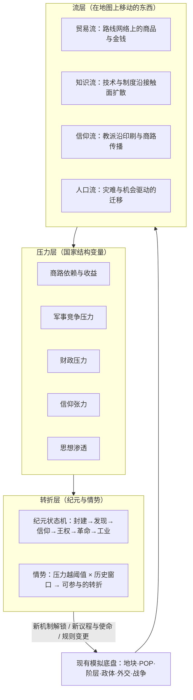

# 11 - 历史因果引擎：还原 14-19 世纪演变底层逻辑的完整设计

结论：**demo2 已经造好了一台合格的"国家经营机器"，反馈循环达标；但历史在这台机器里不会"演变"——世界只有状态，没有方向。要达成"还原 14-19 世纪欧洲演变底层逻辑"的目标，需要在现有底盘上架设第三层架构：历史因果引擎（流层-压力层-转折层）。现有的地块/POP/阶层/政体/外交/战争/情势系统恰好是这个引擎需要的全部地基，方向不必推倒，缺的是"让因果传导起来"的那一层。**

---

## 一、目标重述与"还原底层逻辑"的判据

### 1.1 两条硬标准

| 标准 | 含义 | 反例 |
|---|---|---|
| 历史醍醐味 | 玩家能亲眼看见、亲手参与"压力如何传导成历史"——君堡陷落不是一条新闻，而是一连串看得见的连锁反应的起点 | 1453 年弹一个事件框"君士坦丁堡陷落了"，给西欧各国 +10% 探索加成 |
| 游戏乐趣 | 反馈密度：任何决策在下一回合就能看到第一层后果；任何长链每隔几回合就有可见的中间态 | 玩家点了"资助航海"，80 回合后才知道有没有用 |

### 1.2 "一条历史逻辑被还原"的四个条件

本方案用这四条检验每个机制，后文简称**四性**：

| 条件 | 检验问题 |
|---|---|
| 可见 | 玩家能否在地图或仪表上**看到压力正在积累**（商路收益在涨、教会威信在跌）？ |
| 可干预 | 玩家能否**主动利用**这条逻辑（扮演奥斯曼提前掐断商路、扮演威尼斯花钱保住它）？ |
| 可偏转 | 玩家的干预能否产生**不同但同样可信**的走向（君堡守住了→大发现延迟但不消失）？ |
| 可解释 | 事后游戏能否**讲清因果**（编年史家：因为黎凡特商路成本翻倍，里斯本的桨帆船驶向了未知海域）？ |

**"还原底层逻辑"的定义由此确立：不是复刻事件年表，而是复刻压力的传导方式。相同的压力场 + 不同的决策 = 不同但同样可信的历史。**

---

## 二、现状评估：demo2 离目标有多远

### 2.1 评估总表

| 目标维度 | 现状 | 评级 | 证据 |
|---|---|---|---|
| 即时反馈循环 | 御览预算预测 → 结算 → 御前会议因果季报（每笔变化带原因）；预测与实际误差小 | **已达标** | demo2 实测：预测粮 +32 vs 实际 +23，差额可解释（战斗破坏） |
| 历史开局还原 | 1337 年 34 国、真实领导人、百年战争/尼科米底亚围城开局、来源标注 | **已达标** | `INITIAL_WARS` 带史料链接；丹麦无王期等特例已建模 |
| 静态约束模拟 | 阶层利益、控制力、邻近度、合法性构成"治理难"的结构——这是历史感的**静态**一半 | **基本达标** | 不满阶梯/红色事件/叛军已可玩 |
| 单点情势 | 黑死病有预兆、按纬度波次传播、可应对（封港检疫） | **部分达标** | 但因果只有一跳（人口减、教会得势），缺历史后果（劳力稀缺→农奴制分化） |
| **历史演变的因果传导** | **缺失** | **重大缺口** | 详见 2.2 |
| 时代机制 | 仅文档设想，无任何代码 | **缺口** | 游戏永远停留在"封建纪元"，世界第 7 年开始静态复读 |
| 时间结构 | 季度回合 × 1337-1900 = 2252 回合，无任何方案 | **缺口** | 按当前节奏一局打不完一个世纪 |

### 2.2 因果传导层的五个具体缺失

| # | 缺失 | 代码证据 | 直接后果 |
|---|---|---|---|
| 1 | **没有贸易流**。商品（GOODS）是地块静态属性，只加产出，从不流动；全文搜索不存在任何贸易路线实体 | `output()` 中 `good === "money" ? 2 : 0`；`tradeRoute` 全文 0 处 | "君堡陷落→商路成本上升→西欧找新路"在物理上无法表达——**用户给出的范式案例，当前架构连第一跳都走不通** |
| 2 | **没有知识/技术扩散**。科技字段是死端：`technology.artillery/oceanGoingShips` 初始 false，全代码无任何途径置 true | 第 3322-3323 行定义，仅 `canRecruitCombatType` 读取，无 setter | 印刷术、火药、远洋帆船、启蒙思想——14-19 世纪一半的演变逻辑没有载体 |
| 3 | **地图没有"外面"**。地图东至黑海、西至直布罗陀外缘，无大西洋纵深、无东方商路端点、无新大陆 | `landPolygons` 范围 lon ≈ -12~36 | 地理大发现没有可发现的地理 |
| 4 | **AI 没有历史方向感**。AI 会建设、安抚、按强度比宣战，但没有结构性动机——奥斯曼不知道自己该西进，伊比利亚不知道自己面朝大西洋 | `aiConsiderWar` 只看态度+强度+接壤 | 世界不会"想要"流向任何方向，只会布朗运动 |
| 5 | **资源太抽象**。粮/钱/军需三种通货无法区分"黎凡特的香料"和"波罗的海的粮食"，价格、通胀、白银革命无从谈起 | `country.food/money/military` | 价格革命、重商主义、大西洋经济全部没有表达介质 |

### 2.3 一句话判断

> **demo2 解决了"这个国家好不好管"（09 号方案的命题），还没有触碰"这个世界往哪里去"（本方案的命题）。** 好消息是：阶层-政体-控制力底盘恰好是因果引擎最难做的部分——"军事革命→财政国家→集权与议会分岔"这类最深的历史逻辑，恰恰要跑在已经建成的阶层系统上。

---

## 三、总体架构：历史因果引擎

在现有"模拟底盘"（地块/POP/阶层/政体/外交/战争）与"游戏层"（朝会/敕令/议程/反馈，09 号方案）之间，架设第三层：



| 层 | 回答的问题 | 与现有系统的对接 |
|---|---|---|
| 流层 | 什么东西在国家之间**移动**？ | 路线节点=现有城市/海域地块；扩散接触面=现有邻接与外交关系 |
| 压力层 | 移动如何变成各国的**结构性处境**？ | 压力仪表挂在 `country` 上，与合法性/阶层满意度同级展示 |
| 转折层 | 处境积累到什么程度，历史就**翻页**？ | 复用已建成的情势引擎（预兆→活跃→消退）与纪元解锁 |

**核心论断：历史的"底层逻辑"几乎全部是"流的改道"。** 君堡陷落改的是贸易流的道，印刷术改的是知识流的速，黑死病改的是人口流的量，美洲白银改的是金钱流的源。把"流"做出来，因果就有了physical载体；把"压力"做出来，因果就有了积累与阈值；把"转折"做出来，因果就有了让玩家记住的戏剧时刻。

---

## 四、范式案例：君士坦丁堡的陷落如何引发大发现

用户给出的例子，作为全引擎的设计模板走一遍完整流程。

### 4.1 系统视角：因果链的每一跳

| 跳 | 系统 | 玩家看到什么 |
|---|---|---|
| ① 压力积累 | 奥斯曼的纪元使命「罗马的继承者」+ 军事竞争压力驱动其 AI（或玩家）持续向色雷斯增兵 | 列国纪闻：「奥斯曼大军云集海峡」；拜占庭收红色预警 |
| ② 转折事件 | 君堡地块易手（任何时间、任何攻克者——1453 只是 AI 压力曲线的众数） | 全屏情势卡「第二罗马的陨落」+ 因果链预告：「黎凡特商路的关税将由新主人决定」 |
| ③ 流的改道 | 黎凡特路线节点关税策略改变 → 路线通行成本上升 → 流量按成本弹性向替代路线（红海-亚历山大线）分流并整体萎缩 | **下一回合**：威尼斯/热那亚季报「黎凡特路线收益 -40%」；西欧各国「东方商品价格 +30%」（奢侈品满意度小幅惩罚） |
| ④ 压力转化 | 大西洋沿岸国家的「商路依赖」仪表转为「新航路压力」逐季上涨；地中海商业国「商路衰退」压力上涨 | 葡萄牙/卡斯蒂利亚的议程候选出现金边卡「向未知之海」；威尼斯出现「保卫地中海贸易」 |
| ⑤ 玩家工程 | 新航路 = 多回合工程：远洋帆船（知识流扩散+造船投资）→ 大西洋探索点数（航海家敕令逐季积累）→ 里程碑序列：马德拉→几内亚湾→好望角→印度 | 每 3-5 回合解锁一个里程碑，地图迷雾向外推开一格端点，每个里程碑立即给小额收益（新渔场/黄金海岸贸易点） |
| ⑥ 流的新生 | 好望角路线建立：东方流量大头改道大西洋 → 里斯本/塞维利亚节点暴涨，威尼斯结构性衰退开始 | 编年史家：「香料不再经过圣马可广场」；威尼斯玩家收到转型议程（玻璃工业/金融/陆地扩张） |
| ⑦ 二阶后果 | 新大陆线开通后：白银流入 → 持有过量白银的国家通胀压力（物价上涨=同额金钱买到的产出下降）→ 西班牙悖论 | 拥金而衰的过程每季可见：金库暴涨但实际购买力仪表下跌 |

### 4.2 反事实分支表（四性中的"可偏转"）

| 玩家行为 | 走向 | 为什么仍然可信 |
|---|---|---|
| 拜占庭玩家守住君堡 | 黎凡特线持续但关税仍随奥斯曼控制周边而缓涨；新航路压力**减半而非归零**——红海线仍被马穆鲁克垄断 | 历史上葡萄牙 1415 年就开始非洲探索，早于君堡陷落——压力本来就存在，君堡只是放大器。本引擎把这一点做成机制：探索压力=商路成本基线×各国大西洋区位，君堡只是系数 |
| 奥斯曼玩家 1410 年代提前攻克 | 大发现链提前一个世代启动，威尼斯提前衰退 | 压力传导不看年份只看事实 |
| 威尼斯玩家buy out：巨额岁币换奥斯曼低关税 | 黎凡特线保持，但威尼斯财政被岁币长期失血，新航路压力仍缓慢积累 | "用钱续命"正是威尼斯真实历史策略，且有真实代价 |
| 法兰西玩家无视海洋 | 法兰西不参与大发现，但大西洋邻居的殖民收入会在五十年尺度上反映为国力对比恶化（列强榜可见） | 不下场也要承担不下场的后果 |

### 4.3 这个案例确立的设计模板

每条历史逻辑链都按此模板落地：**压力可视化 → 转折情势卡（带因果预告）→ 下一回合即见的流改道 → 解锁针对性议程/敕令 → 里程碑化的玩家工程 → 二阶后果**。

---

## 五、流层设计

### 5.1 贸易路线系统（最高优先级的新系统）

**数据结构**：路线 = 命名的节点链（节点映射到现有城市/海域地块 + 少量图外端点），首发 10 条：

| 路线 | 端点→端点 | 关键节点 | 初始流量 | 主要受益者 |
|---|---|---|---|---|
| 黎凡特线 | 东方端点→威尼斯 | 君士坦丁堡/亚历山大、克里特、威尼斯 | 高 | 威尼斯、拜占庭/马穆鲁克 |
| 黑海线 | 东方端点→热那亚 | 卡法（图外）、君士坦丁堡海峡、热那亚 | 中 | 热那亚、拜占庭 |
| 红海线 | 东方端点→亚历山大 | 亚历山大、开罗 | 中 | 马穆鲁克 |
| 汉萨线 | 诺夫哥罗德→伦敦 | 波罗的海、吕贝克（神罗北岸）、低地 | 中 | 北德城市、英格兰 |
| 香槟-莱茵线 | 威尼斯→低地 | 米兰、莱茵走廊、弗兰德斯 | 中 | 神罗城市、弗兰德斯 |
| 大西洋沿岸线 | 里斯本→低地 | 塞维利亚、里斯本、南特、布鲁日 | 低 | 葡萄牙、卡斯蒂利亚 |
| 马格里布线 | 撒哈拉端点（黄金）→突尼斯/非斯 | 马格里布诸港 | 低 | 马林、哈夫斯 |
| 好望角线（锁定） | 东方端点→里斯本 | 几内亚、好望角（图外）、里斯本 | 0→解锁后高 | 开拓者 |
| 新大陆线（锁定） | 美洲端点→塞维利亚 | 加纳利（图外）、塞维利亚 | 0→解锁后高（含白银属性） | 开拓者 |
| 波罗的海粮道（信仰纪元解锁） | 但泽→低地 | 波罗的海、厄勒海峡 | 0→中 | 波兰、丹麦（海峡税） |

**结算规则（每季）**：

```text
节点收入 = 路线流量 × 节点份额 × 节点政策系数
路线成本 = Σ(节点关税 + 战争风险 + 海盗/劫掠)
流量再分配：成本上升的路线把流量按弹性让给替代路线，总流量随总成本萎缩
```

- 节点控制者可设关税档位（敕令）：低关税养流量，高关税竭泽而渔——这本身就是"奥斯曼选择"的玩家化；
- 战争中封锁海峡/围攻节点城市立即压低流量——海军和要塞第一次有了经济意义；
- 商人阶层的权力与满意度部分挂钩本国节点收入——商业共和国的兴衰由此结构化。

**四性自检**：可见（路线地图模式+节点收入面板）；可干预（关税/护航/岁币/夺取节点）；可偏转（流量再分配是连续函数不是开关）；可解释（季报：「黑海线因卡法瘟疫流量 -20%」）。

### 5.2 知识与制度扩散系统

复活死端的 `technology` 字段，扩展为**进步（Advances）**：

| 进步 | 纪元 | 扩散介质 | 采纳条件（政治代价） | 不采纳的后果 |
|---|---|---|---|---|
| 火药武器 | 封建 | 战争接触（被打过就见识过） | 金钱+军需投资 | 战场代差 |
| 棱堡工事 | 发现 | 邻接扩散 | 巨额金钱 | 要塞被炮兵快速攻克 |
| 远洋帆船 | 发现 | 大西洋港口+商路 | 海洋改革≥2+造船投资 | 无法参与大发现 |
| 活字印刷 | 发现 | 商路+城市密度 | 教会满意 -10（失去抄经垄断） | 思想传播慢、行政效率低 |
| 复式记账 | 发现 | 商路（意大利源点） | 商人权力 +5 | 财政效率低 |
| 常备军 | 信仰 | 军事竞争压力倒逼 | 财政改革≥2+贵族满意 -15（夺其军役地位） | 战时动员慢、战力衰减 |
| 宗教改革思想 | 信仰 | 印刷×教会不满（见 5.3） | ——它自己找上门 | —— |
| 三角贸易体系 | 王权 | 大西洋路线 | 海洋改革+殖民据点 | 错过大西洋经济 |
| 启蒙思想 | 王权 | 印刷×城市×宽容 | 无法拒收，只能镇压（合法性代价）或疏导（改革） | 革命压力积累 |
| 财政-军事国家 | 王权 | 战争竞争倒逼 | 政体路线决定形态：集权 or 议会举债 | 大战必破产 |
| 蒸汽机 | 革命 | 煤区+资本+识字率 | 行会满意 -10（机器夺业） | 大分流的输家 |
| 铁路 | 工业 | 邻接+资本 | 巨额投资 | 动员与市场半径劣势 |

**核心设计**：采纳不是"点科技树"，而是**一次有阶层代价的政治决策**（弹出决议卡）。这让"为什么有的国家先进有的落后"从规则里自然长出来——奥斯曼禁印刷不是剧本，是"教会类阶层权力高的国家采纳印刷的政治代价更高"这条规则的实例。**这是醍醐味浓度最高的一条设计。**

### 5.3 信仰与思想传播（复用扩散引擎）

宗教改革 = 扩散引擎的特例：印刷术覆盖度 × 当地教会满意度（越低越易感）× 城市密度 → 地块逐季"改宗压力"，玩家用现有宗教法/宽容敕令/镇压应对，处理方式塑造信仰纪元的阵营格局。启蒙思想用同一引擎，易感因子换成市民阶层权力与识字率。**一套引擎跑两个纪元的核心逻辑，工程上极划算。**

### 5.4 人口与资本流（轻量）

黑死病后已减员的地块劳力稀缺 → 农民议价力上升：西欧型（控制力低、城市近）地块自动出现"劳役松动"地方诉求，东欧型（贵族控制度高）出现"再版农奴制"诱惑决议——同一场瘟疫在不同结构里产生相反后果，正是底层逻辑还原的标本。资本流：节点收入的一部分沉淀为城市"资本池"，是后期工业化的前置资源（轻量计数即可）。

---

## 六、压力层设计

每国常驻五个压力仪表（御前会议与国家面板可见，构成"国家处境"的一眼读）：

| 压力 | 来源 | 高压时的系统效果 | 玩家泄压手段 |
|---|---|---|---|
| 商路依赖 | 本国收入中节点收入占比 | 路线波动直接放大为财政波动 | 多元化、转型议程 |
| 军事竞争 | 邻国军力/军事进步与本国之差 | 不应对则战败风险与贵族不满上升 | 采纳军事进步、结盟——但每一样都有阶层代价 |
| 财政压力 | 军费+宫廷+债务利息 vs 收入 | 高压触发加税选择→阶层连锁 | 财政改革、举债（王权纪元解锁国债，埋下革命引线） |
| 信仰张力 | 异端地块比例×教会权力 | 触发宗教情势的易感度 | 宽容或镇压路线 |
| 思想渗透 | 启蒙/民族主义扩散覆盖度 | 革命情势易感度 | 改革疏导或镇压（镇压只是延迟并加息） |

压力的双重作用：**对玩家是预警与解锁**（高压解锁对应议程卡与敕令）；**对 AI 是战略动机**（取代现在的布朗运动）：奥斯曼的军事压力公式天然驱动其向最富节点（君堡）扩张，伊比利亚的商路依赖+大西洋区位天然驱动其探索——**世界由此获得方向感，而方向感来自规则而非剧本**。这同时是 09 号方案 P2（LLM 国策备忘录）的输入接口：备忘录的"国情摘要"主体就是压力仪表。

---

## 七、转折层：六大纪元及其底层逻辑

每纪元给出：驱动链（本纪元的"底层逻辑"）、进入判据（窗口+条件，非硬日期）、玩家的纪元课题。

| 纪元 | 年代基线 | 驱动链（可游玩的因果） | 进入判据 | 玩家课题 |
|---|---|---|---|---|
| 封建 | 1337-1453 | 黑死病→劳力稀缺→农奴制东西分化；百年战争→战争财政→常备军萌芽；商路东端不稳 | 开局 | 治理与生存（demo2 已完整） |
| 发现 | 1450s-1520s | 君堡链（第四章范式）；印刷扩散；火药→城堡贬值→集权窗口 | 君堡易手 或 远洋帆船+探索里程碑×2（双触发，谁先到算谁） | 抢航路 或 守旧路；集权窗口期 |
| 信仰 | 1510s-1648 | 印刷×教会不满→改宗扩散→国内信仰张力→宗教战争阵营化→大和会（威斯特伐利亚式情势：参战各方谈出新外交规则——主权体系，条约神圣性永久增强） | 宗教改革情势爆发（条件：印刷覆盖≥N 且任一大国教会满意≤阈值，窗口 1505-1540） | 选边、宽容或铁腕；阵营战争 |
| 王权 | 1648-1789 | 军事竞争→财政-军事国家→**集权 vs 议会两条路**（贵族强走绝对主义，商人强走宪政——跑在现有阶层系统上）；大西洋经济→商人阶层坐大；启蒙扩散 | 大和会落幕 | 政体路线抉择；殖民竞争；国债与破产边缘 |
| 革命 | 1780s-1848 | 财政破产×启蒙渗透×市民权力→革命情势（叛乱系统的纪元强化版：革命会**跨国传染**）；民族主义扩散 | 任一大国财政压力+思想渗透双红 | 镇压、立宪或输出革命 |
| 工业 | 1840s-1900 | 煤铁×资本池×制度（行会弱+议会强的国家先发）→产出曲线分流→列强体系 | 蒸汽机采纳国≥3 | 终局冲刺与最终评分（大分流榜） |

- 纪元转换出全屏"纪元卷轴"：上一纪元编年史摘要 + 新规则/新议程/新使命预告——既是奖励节点，也是分享素材；
- 后期纪元（王权起）地图行政自动化增强（总督委任打理地块级操作），玩家注意力随历史重心上移到国策层——**这同时是 2252 回合问题的减负手段之一**。

---

## 八、反馈密度设计：醍醐味与乐趣的接口

### 8.1 三回合守则（全引擎的硬约束）

**任何机制，玩家做出相关决策后 ≤1 回合必须有第一层可见反馈，≤3 回合必须有数值变化，长链每 ≤5 回合必须有里程碑。** 达不到的机制砍掉或合并。本守则写进每个新系统的验收标准。

### 8.2 决策回响系统（直接回应"决策后下一回合就获得反馈"）

新增**决策台账**：玩家每个重要决策（敕令/决议/议程/采纳进步/关税档位）登记一条回执，注明预期效果与兑现期；此后每季御前会议新增「回响」栏：

> 「上季你颁布《盾牌钱》→ 军需 +40 已入库；商人满意 -8，行会已在抱怨。」
> 「三季前你资助的航海学校 → 本季探索点数首次产出 +2。」

实现上是轻量的：`country.decisions[]` 登记 → 结算时比对兑现 → 朝会渲染。**它把"系统在响应你"变成每回合的确定性体验，是乐趣标准的兜底保险。**

### 8.3 因果链卡

重大转折（情势、纪元、节点易手）的事件卡附带「为什么」按钮：展开 3-5 跳的因果链（数据直接来自流层/压力层的实际记录，不是手写文案）。列国纪闻条目同样可点开溯源。**让"理解历史"成为一个游戏内动作。**

### 8.4 长链的里程碑化

以大发现链为模板：任何超过 10 回合的工程必须拆成 3-7 个里程碑，每个里程碑独立给即时小奖励 + 推进可视化（探索进度条/航线虚线延伸）。已有的使命/议程系统就是里程碑的容器，无需新框架。

### 8.5 编年史家升级

现有编年史册从"事件列表"升级为"因果叙事"：每条记录保存其触发来源链，终局国史按链组织（"因为…所以…然而…"）。这是 P2 阶段 LLM 表演层的最佳落点——把真实因果数据交给 LLM 写成史书，杜绝幻觉（数据是真的，文笔是生成的）。

---

## 九、时间结构：560 年怎么玩

### 9.1 推荐方案：季度回合 + 速演 + 纪元书卷

| 组件 | 设计 |
|---|---|
| 回合 | 恒定季度（保留现有全部结算与"下一回合反馈"体验） |
| **速演模式** | 玩家设定常备方针（建设优先级/外交姿态/征兵线）后点「垂帘」：游戏连续自动结算，直到**中断条件**触发——红色事件、情势预兆、战争波及、使命/议程达成、压力仪表变色、玩家自设监视点。中断时弹出"摄政报告"（速演期间大事摘要）。和平年代 30 年≈数十秒 |
| 纪元书卷 | 纪元转换为天然章节存档点；一局战役=六卷书；单卷精玩 15-25 个关键年代 |
| 后期减负 | 王权纪元起总督自动化+敕令批量化，玩家操作密度不随领土膨胀 |

一局时长模型：每纪元密集游玩 60-100 回合 + 速演穿越平静期 ≈ 2-4 小时/纪元，全战役 12-20 小时，微信端按卷续局。

### 9.2 备选方案及弃选理由

| 方案 | 弃选理由 |
|---|---|
| 变速回合（平时 1 回合=1 年，战时切季度） | 所有按季调校的系统（粮食、补给、任期）需要双套数值；"一回合"含义不稳定伤害预测可信度 |
| 一局=一个纪元，独立开局 | 砍掉"亲手把一个国家从 1337 带到 1900"的传承体验——那正是"还原演变"的情感核心 |
| 实时暂停制 | 与微信小游戏短会话、回合制定位冲突 |

---

## 十、还原性与乐趣的冲突裁决准则（升级版）

在 09 号方案六原则之上，针对"因果引擎"新增四条：

| 准则 | 内容 |
|---|---|
| 必然性=压力，偶然性=窗口 | 历史结果是概率云：压力决定"大势所趋"，窗口与玩家行为决定"何时何人何种形态"。君堡的陨落值很高但不是 1453 的脚本 |
| 反事实代价守则 | 每条"历史没走的路"必须有真实代价与真实收益（守住君堡的拜占庭仍要面对绕路压力与岁币失血），杜绝"无成本改写历史"的爽文感 |
| 链条透明守则 | 玩家输了要能说出"输在哪一跳"；玩家赢了要能说出"赢在哪一跳"。做不到就是引擎失败，不是玩家失败 |
| 醍醐味清单 | 每个纪元交付前自检：玩家能否在游玩中**自己说出**至少两句"原来如此"（例：「原来威尼斯衰落不是打输了，是货不走这儿了」「原来绝对主义和议会制是同一道财政压力题的两个答案」）。说不出=还原失败 |

---

## 十一、开发路线（从 demo2 出发）

| 阶段 | 内容 | 验收标准 |
|---|---|---|
| 一：引擎骨架（不扩地图） | 贸易路线系统（首发 7 条欧洲内路线）+ 节点关税敕令 + 压力仪表（先做商路依赖/军事竞争/财政三个）+ 决策回响 + 速演模式 | 威尼斯玩家能看见并干预自己的商路收入；任意决策下回合有回响；速演 10 年无崩溃 |
| 二：君堡垂直切片 | 东方端点+大西洋边缘扩图；奥斯曼压力使命；君堡转折情势+因果链卡；远洋帆船进步+探索里程碑；好望角/新大陆线 | **三名测试者分别扮演奥斯曼/拜占庭/葡萄牙，产生三种不同但可信的 1440-1520 走向，且都能复述因果链** |
| 三：信仰纪元 | 扩散引擎（印刷→改宗）+ 信仰张力 + 宗教战争阵营 + 大和会情势 + 纪元卷轴 | 改宗地图随局不同；和会产生的新规则可被言明 |
| 四：LLM 战略层（=09-P2 合流） | 压力仪表作为国策备忘录输入；编年史家 LLM 化 | AI 行为可被玩家用"它的处境"解释 |
| 五：王权与革命纪元 | 财政-军事国家分岔、国债、启蒙扩散、革命传染 | 同一财政危机在不同阶层结构下走向专制/立宪/革命三种结局 |
| 六：工业终局 | 蒸汽机扩散、大分流评分、全战役收官 | 1337→1900 完整一局可玩可述 |

阶段一、二合计即可交付"君堡范式"的完整体验——**建议以此为下一个里程碑**，它是整个目标的最小完整证明。

---

## 十二、待定决策

| #   | 问题                         | 倾向建议                                  |
| --- | -------------------------- | ------------------------------------- |
| 1   | 新大陆做真实地图还是图外端点             | 第一版图外端点+殖民据点抽象（工程省 10 倍），工业纪元前评估是否实体化 |
| 2   | 白银通胀模型的深度（全局物价 vs 简化购买力系数） | 简化：国家级"物价指数"系数，作用于产出实际值               |
| 3   | 速演的中断粒度默认值                 | 默认"红色+情势+战争"三类中断，其余可选，避免速演形同虚设        |
| 4   | 信仰纪元的教派数量                  | 首版两派（旧教/新教）+ 东正教既有格局，不做细分教派           |
| 5   | 全战役 12-20 小时是否符合微信端定位      | 需要一次真实留存测试再定；纪元书卷结构保证了"砍后期纪元"的退路      |

---

## 关联文档

- [[09-游戏机制完整策划方案]]（游戏层：本方案的反馈密度标准继承自其 P0 成果）
- [[10-Demo2游戏层实现说明]]（现状基线）
- [[06-战争与和平系统设计]]、[[04-国家外交系统设计]]（底盘）
- [[欧陆风云5开发日志与机制汇总]]（"情势"概念的来源与前车之鉴）
