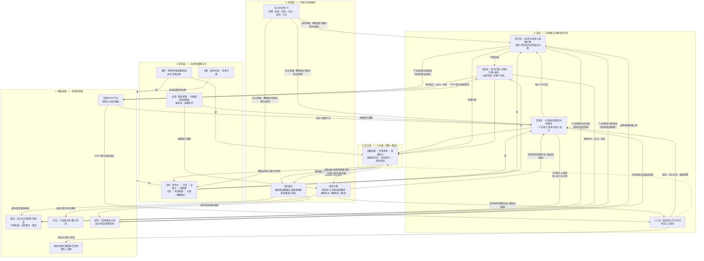

# 15 - 全机制 Review 与完整框架图

结论：**五层架构整体健康，历史因果引擎的核心思路（流→压力→转折，反馈密度兜底）不需要调整。本轮联检发现 4 处冗余、2 处暗冲突、4 处缺关联，已全部处置；最大的新增是「科技」界面——知识流此前是四个流中唯一没有自己界面的，扩散状态完全不可见。文末给出两张框架图：机制联动维度与游玩时间线维度。**

---

## 一、Review 总表

### 1.1 冗余（已处置）

| # | 发现 | 判定 | 处置 |
|---|---|---|---|
| R1 | 「整军经国」按钮：+合法性+集权-贵族-教会，与加冕巡游（合法性）、行政/政治改革（集权）完全重叠，是 09 号方案前的遗留动词 | 真冗余 | **删除**。其全部功能由改革槽与敕令承担 |
| R2 | 商贸繁荣情势：绕过贸易系统直接按市场数注钱——它诞生于贸易流之前 | 真冗余+暗冲突（两套贸易经济并行注入） | **并入流量池**：繁荣期改为全部流量池 +25%（消费 `poolBonus` 预留接口），收益自然沿路线/节点/关税分配，商人满意保留 |
| R3 | 国家面板「统治合法性」与 HUD「合法性」同值双显 | 展示冗余 | 国家面板该格改显**资本池**（原先埋在商路面板里） |
| R4 | 进步采纳卡寄居在政制·决议面板里，与决议混排 | 归类混乱 | 迁入新建的**科技界面**（见 L1） |

### 1.2 冲突（已处置/判定不冲突）

| # | 发现 | 判定 | 处置 |
|---|---|---|---|
| C1 | 法律（laws）六类字段自原始 demo 起就是静态展示，从未变化——而劳役分岔、改宗国教、财政分岔这些**结构决策本质上就是在改法律**，两者互不相认 | 暗冲突（同一概念两套表达） | **法律字段激活**：劳役松动→土地法"自由农地"、再版农奴制→"再版农奴制"、改宗国教→宗教法"新教国教"、财政分岔→税法"王室专卖/议会国债"、常备军→兵役法"常备军役"、关税档位→贸易法。法律面板从摆设变成**国家结构决策的活档案** |
| C2 | 地块市场/港口的产出加成（地块经济） vs 商路节点收入（路线经济）并行 | 不是冲突，是**分层**：地块经济=本地市场模拟，商路经济=跨国流量 | 保留双层，框架图中明确标注 |
| C3 | 探索点数三处阈值不一致（被动 40 / 敕令 15 / AI 35） | 轻微不一致 | 被动统一到 35 |
| C4 | 阶层安抚有三条 AI 路径（阶梯自动让步 / 内政安抚 / 信仰镇压） | 不冲突：阈值与资源各自约束 | 保留 |

### 1.3 缺关联（已补）

| # | 发现 | 处置 |
|---|---|---|
| L1 | **知识流是四个流中唯一没有界面的**：进步的扩散状态（谁有、从哪来、还缺什么条件）完全不可见 | **新增「科技」页签**：9 项进步按纪元分组，四态展示（已采纳/可采纳/已知晓未达条件/尚未知晓），列国采纳数与扩散提示，资本池门槛进度，采纳操作迁入 |
| L2 | 军事竞争压力仪表只发预警，不驱动任何行为——军备竞赛缺最后一环 | **接入 AI**：军事压力 ≥55 的国家优先采纳火药/常备军/棱堡，且降低储备金门槛——"邻居有炮我也要有"成为涌现行为 |
| L3 | 思想渗透只有积累没有反制——革命循环缺玩家动词 | 新增两道敕令：**《书报检查》**（渗透 -12，合法性与商人代价——镇压只能延迟）与**《开明改革》**（渗透 -15、议会 +8、集权 -4——疏导有制度代价），与方案"镇压只能延迟，改革才能疏导"对齐 |
| L4 | 商人权力挂钩商路（14 号已修），但首轮实现被 refreshPolitics 公式重算冲掉 | 已写入权力公式本身（结构项 +min(14, 收入/6)） |

### 1.4 判定保留不动的

| 项 | 理由 |
|---|---|
| 决议 vs 敕令双卡系统 | 不是冗余而是节奏区分：决议=一次性的结构抉择（改宗/分岔/政体），敕令=带冷却的可重复国策。科技独立后三者边界清晰 |
| 议会议程 vs 敕令的局部效果重叠（宽容议案 vs 宽容敕令） | 议会版需要支持率与让步（政治协商），敕令版即时但代价直付——同一目标的两条政治路径正是阶层系统的玩法 |
| estateHolding 地产标签 | 仅展示用的风味数据，无行为，成本为零 |

---

## 二、完整框架图 · 维度一：机制联动

读图要点：**因果的主干是顺时针大环**——底盘供养流层，流层积累压力，压力触发转折，转折改写底盘与游戏层的规则；玩家（游戏层）从压力仪表读处境、用动词写底盘与流层、靠反馈链理解后果。

---

## 三、完整框架图 · 维度二：游玩时间线

```mermaid
flowchart LR
    subgraph LOOP["每一季的恒定循环（任何纪元不变）"]
        direction LR
        A1["朝会<br/>预警·季报·谏言·回响"] --> A2["决策<br/>敕令/议程/科技/关税/建设/军令"] --> A3["御览<br/>下季预算预演"] --> A4["结算<br/>全世界同时行动"] --> A1
    end

    LOOP -.-> E1

    subgraph E1["封建纪元 1337~"]
        F1["主线情势：黑死病（预兆→波次北传）<br/>小冰期·百年战争"]
        F2["玩家课题：治理与生存<br/>阶层阶梯·粮食·控制力"]
        F3["流层苏醒：商路收入·关税档位<br/>火药沿战争扩散"]
        F4["分岔点：劳役松动 vs 再版农奴制<br/>（同一场瘟疫，两种国家）"]
    end

    subgraph E2["发现纪元 ~1450s"]
        D1["转折：君堡易主（或探索双触发）<br/>黎凡特/黑海成本飙升"]
        D2["玩家课题：抢航路 or 守旧路<br/>远洋帆船→里程碑→好望角/新大陆"]
        D3["新压力：新航路冲动·白银物价<br/>印刷扩散侵蚀教会权威"]
    end

    subgraph E3["信仰纪元 ~1500s"]
        R1["转折：宗教改革（萨克森火种）<br/>改宗地图每局不同"]
        R2["玩家课题：镇压/宽容/改宗国教<br/>跨信仰战争门槛大降"]
        R3["出口：大和会三规<br/>教随国定·条约神圣·常驻使节"]
    end

    subgraph E4["王权纪元 ~1650s"]
        A5["财政-军事国家分岔：<br/>绝对主义专卖 vs 议会国债"]
        A6["军备竞赛：常备军·棱堡<br/>军事压力驱动列国跟进"]
        A7["暗流：启蒙渗透开始积累<br/>反制：书报检查 vs 开明改革"]
        A8["减负解锁：总督代理"]
    end

    subgraph E5["革命纪元 ~1780s"]
        V1["转折：财政×思想双红→革命爆发<br/>革命军上图·思想跨国传染"]
        V2["玩家课题：镇压只能延迟<br/>改革疏导 or 输出革命"]
    end

    subgraph E6["工业纪元 ~1840s"]
        I1["门槛：资本池→蒸汽机→铁路<br/>（贸易→资本→工业的百年闭环）"]
        I2["终局：大分流榜<br/>编年史册收卷"]
    end

    E1 ==>|"纪元卷轴"| E2 ==>|"纪元卷轴"| E3 ==>|"纪元卷轴"| E4 ==>|"纪元卷轴"| E5 ==>|"纪元卷轴"| E6

    LONG["跨纪元长线：垂帘听政穿越平静年代 ｜ 决策回响逐季兑现 ｜ 编年史持续记录 → 国家史诗"]
    E1 -.-> LONG -.-> E6
```

读图要点：**内环恒定、外环演替**——"朝会→决策→御览→结算"的季度循环从 1337 年到 1900 年不变（反馈密度的保证），而每个纪元向这个循环里注入新的情势、新的动词、新的压力主题；纪元卷轴是章节感的来源，垂帘与总督代理保证 560 年在操作上可承受。

---

## 四、一季的体验串讲（机制如何在 5 分钟里咬合）

> 1463 年春，威尼斯。朝会开场：红色预警「黎凡特线成本 ×1.85」——上季君堡换了主人（转折层）。季报显示商路收入 29→21（流层→国库），决策回响提醒「两季前你定的低关税已让流量回流 +6%」。廷臣进言：王室总管建议转向红海线，大法官提示议程卡「保卫地中海贸易」已解锁（压力层→游戏层）。你颁布《特许市集》安抚商人（阶层阶梯回稳），在科技界面看到「复式记账」可采纳（知识流），切到贸易地图确认红海线变粗（可视化）。御览预测下季金钱 +96，确认结算——全世界同时行动，奥斯曼的关税敕令、葡萄牙的航海资助、法兰西的围城都在同一刻落子。

## 五、一局的生命周期串讲

> 开局（封建）你学会读朝会、喂饱粮仓、在黑死病的预兆期囤粮封港；瘟疫过后你为劳力稀缺选择了道路——这个决定写进了土地法，也写进了百年后的国运。发现纪元你或是掐住海峡的人，或是绕过海峡的人；信仰纪元你的印刷机既送来文书效率也送来萨克森的小册子，大和会后你的外交官多了一个使节名额。王权纪元你在专卖与国债之间选了后者，于是革命纪元的引线比邻国短了一截——书报检查只能延迟它。当蒸汽机的门槛被你百年积累的资本池跨过时，编年史册已经写满十四卷：这局的大分流榜上，你的名字在第二行，输给了那个一直没参战、安静收了三百年海峡税的国家。

---

## 六、本轮代码变更摘要

| 类型 | 变更 |
|---|---|
| 删除 | 整军经国按钮与函数（功能由改革槽/敕令承接） |
| 合并 | 商贸繁荣 → 流量池加成（poolBonus 接口启用） |
| 激活 | 法律六字段成为结构决策的活档案（土地/税/兵役/宗教/贸易） |
| 新增 | **科技界面**（第 9 页签）：四态进步卡+扩散信息+资本池门槛；《书报检查》《开明改革》敕令；AI 军备竞赛（军事压力驱动采纳优先级） |
| 调整 | 国家面板重复的合法性格→资本池；探索被动阈值统一 35 |

## 关联文档

- [[11-历史因果引擎完整设计方案]]（核心思路，本轮未动）
- [[12-历史因果引擎阶段一二实现说明]] / [[13-纪元状态机与信仰纪元实现说明]] / [[14-流层补齐实现说明]]
