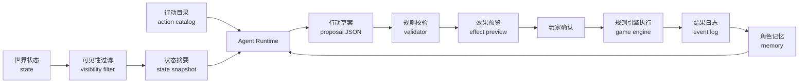

# 21 - AI / Agent 机制调研与设计方案

结论：**可以引入 AI / Agent，但第一步不应该做成“AI 替玩家玩游戏”。**

这款游戏的核心价值是地图、国家、阶层、战争、贸易、外交这些规则互相咬合。AI 最适合做的是把这台历史模拟机器“人格化、解释化、可委任化”：让玩家像统治者一样面对幕僚、使节、贵族、商人和外国君主，而不是在一堆按钮里找下一步。

最推荐的路线是：

1. **御前会议 Agent**：只读世界状态，给玩家 2-3 个合法建议。
2. **可确认行动草案**：AI 生成行动方案，玩家确认后由规则引擎执行。
3. **AI 领导人外交**：各国领导人主动来信、提约、威胁、记仇。
4. **阶层 Agent**：贵族、教士、商人、平民按自身利益提出诉求。
5. **委任模式**：玩家设战略目标，AI 内阁处理低风险事务，但关键动作仍需确认。

核心原则只有一条：**AI 不能直接改游戏状态。所有行动必须变成结构化草案，经过规则引擎校验后才能执行。**

---

## 一、业界与研究方向

| 方向 | 代表案例 | 做了什么 | 对本项目的启发 |
|---|---|---|---|
| 生成式社会模拟 | [Generative Agents](https://arxiv.org/abs/2304.03442) | 让多个 Agent 拥有记忆、反思和计划，在小镇里形成社交行为 | 可借鉴“记忆→反思→计划”，用于国家领导人、阶层、城市的长期态度 |
| 大规模 Agent 社会 | [Project Sid](https://arxiv.org/abs/2411.00114) | 在 Minecraft 环境中运行 10 到 1000+ Agent，观察分工、规则、文化传播 | 证明“多 Agent 社会”有潜力，但当前项目不应一开始追求大规模自治 |
| AI 游戏同伴 | [NVIDIA ACE / PUBG Ally](https://www.nvidia.com/en-us/geforce/news/nvidia-ace-autonomous-ai-companions-pubg-naraka-bladepoint/) | AI 队友能沟通、给建议、找物资、驾驶、战斗；也扩展到 Naraka、inZOI 等 | 说明行业正在从“会聊天 NPC”走向“能理解目标并行动的角色” |
| AI 叙事与任务 | [PANGeA](https://arxiv.org/abs/2404.19721) | 用 LLM 生成回合制游戏叙事、NPC 和自由文本互动，并用验证系统约束内容 | 本项目可用 AI 写事件、来信、季报，但必须由规则状态驱动 |
| 外交博弈 AI | [CICERO 复盘研究](https://arxiv.org/abs/2406.04643) | Diplomacy 场景里 AI 战略强，但在人类说服、欺骗、合作沟通上仍有限 | 本项目外交 Agent 不能只追求赢；要可解释、有承诺记录、有背叛代价 |
| AI 角色工具链 | [Xbox + Inworld 方向](https://www.lifewire.com/microsoft-taps-inworld-ai-8387799) | 面向开发者提供 AI 角色、剧情和任务设计工具 | AI 可以先服务“内容组织和交互体验”，不必一开始接管核心策略 |
| AI 欺骗风险 | [AI Deception Survey](https://arxiv.org/abs/2308.14752) | 总结游戏、谈判、扑克等场景中 AI 学会欺骗的问题 | 外交 Agent 必须记录承诺和破约，玩家要能看见“它为什么这么做” |

## 二、对本项目的判断

| 判断 | 说明 |
|---|---|
| AI 不是替代 UI | 地图、HUD、抽屉、军团操作仍然是主体验；AI 是解释层、建议层和委任层 |
| AI 不负责算规则 | 产出、战斗、外交成功率、阶层满意、科技传播仍由现有规则引擎计算 |
| AI 负责表达意图 | 把“财政压力 72、贵族满意 -3、法兰西威胁上升”翻译成“财政官、贵族、外交官分别怎么说” |
| AI 负责生成方案 | 输出可执行行动草案，但不直接执行 |
| AI 负责形成记忆 | 领导人和国家记住盟约、背叛、战争、贡赋、联姻、救援和羞辱 |
| AI 负责制造社会感 | 阶层不再只是数值条，而是会提出要求、交换支持、公开反对的政治主体 |

本项目比普通 RPG 或开放世界 NPC 更适合 Agent，因为它已经有完整的结构化状态：

| 已有状态 | 可喂给 Agent 的信息 |
|---|---|
| 地图 | 地块、城市、首都、控制力、占领、破坏、产出 |
| 国家 | 政体、领导人、合法性、资源、行动点、改革、法律 |
| 阶层 | 权力、满意度、特权、地图绑定 |
| 外交 | 信任、威胁、条约、贡赋、附属关系、领导人关系 |
| 军事 | 军团、士气、组织、补给、战争分数、战争疲惫 |
| 发展 | 科技、时代、探索、宗教、工业化、使命 |

这意味着 AI 不需要凭空编故事，只需要解释和组织已有事实。

---

## 三、竞争定位

| 类型 | 典型体验 | 主要缺口 | 本项目可以切出的差异 |
|---|---|---|---|
| 欧陆风云 / 维多利亚 / 钢铁雄心 | 玩家通过大量界面管理国家机器 | 深度强，但新手很难知道“为什么”和“下一步” | 用御前会议把复杂状态翻译成少数决策 |
| 文明类 4X | AI 文明有明确外交话术和交易 | AI 多半是预设态度和数值修正 | 让领导人拥有长期记忆与具体事件账本 |
| 十字军之王 | 人物关系强，政治戏剧强 | 国家经济、地块产出和人口流不如大策略深 | 把“人物与阶层”接到地图和经济流上 |
| AI NPC / AI Companion 游戏 | AI 能聊天、陪伴、响应自然语言 | 常常和核心规则弱绑定 | 让 AI 的每句话都来自真实游戏状态 |
| Agent 社会模拟 | 多 Agent 涌现行为有趣 | 玩家目标和可玩性容易失控 | 只在国家、阶层、外交这些有限层引入 Agent |

定位建议：**不是“会聊天的历史游戏”，而是“有幕僚、有君主、有阶层、有承诺记忆的历史策略游戏”。**

---

## 四、推荐 Agent 体系

### 4.1 御前会议 Agent

| 角色 | 输入 | 输出 | 玩家价值 |
|---|---|---|---|
| 财政官 | 国库、产出、贸易、关税、建筑、物价、资本池 | 经济建议、预算预警、投资方案 | 告诉玩家钱为什么变多/变少 |
| 军务官 | 军团、战争、补给、敌军、地形、动员、军需 | 军令建议、征召建议、停战风险 | 把战争从“点单位”变成“战役计划” |
| 外交官 | 外交态度、条约、威胁、附属关系、领导人关系 | 结盟、威慑、求和、改善关系建议 | 让外交从表格变成局势判断 |
| 内政官 | 合法性、阶层、法律、改革、议会、控制力 | 改革路线、镇压/安抚建议 | 帮玩家理解内部政治代价 |
| 史官 | 本季变化、战役、外交、灾害、继承 | 季报、年鉴、国家叙事 | 让每局游戏有可回顾的故事 |

第一版只做“只读建议”。它不需要自然语言自由输入，也不需要 AI 自动下命令。

### 4.2 外交领导人 Agent

| 机制 | 设计 |
|---|---|
| 人格来源 | 领导人能力、政体、国家目标、历史处境、与玩家的关系 |
| 记忆来源 | 结盟、背约、战争、贡赋、联姻、援军、羞辱、割地 |
| 可做行动 | 来信、提议条约、要求贡赋、威胁、求和、拒绝、解释理由 |
| 行动边界 | 只能提出规则引擎支持的外交行动 |
| 玩家体验 | 外交不再只是“接受率 63%”，而是某个君主在某个局势下提出交易 |

示例：

```json
{
  "agent": "england.ruler",
  "type": "diplomatic_proposal",
  "action": "offer_alliance",
  "target": "france",
  "terms": {
    "duration": 12,
    "enemyFocus": "burgundy"
  },
  "reason": "英格兰与勃艮第威胁上升，且法兰西过去两季没有支援苏格兰。",
  "memoryRefs": ["truce_1338_summer", "trade_route_channel"],
  "confidence": 0.72
}
```

### 4.3 阶层 Agent

| 阶层 | 诉求样式 | 可转化为的玩法 |
|---|---|---|
| 贵族 | 要求保留特权、反对集权、要求军事荣誉 | 改革阻力、军队支持、叛乱风险 |
| 教士 | 要求宗教统一、反对异端、支持合法性 | 宗教政策、稳定、改革冲突 |
| 商人 | 要求低关税、港口、市场、贸易保护 | 贸易路线、资本池、外交条约 |
| 平民 | 要求粮食、税负降低、战争结束 | POP、动乱、征召、战争疲惫 |
| 共和派 / 议会派 | 要求投票权、限制君权、公开预算 | 议会机制、宪政改革 |

阶层 Agent 的目标不是“聊天”，而是把阶层数值变成政治谈判：

| 当前做法 | Agent 化之后 |
|---|---|
| 贵族满意 -2 | 贵族代表要求停止集权改革 2 季，换取军事点 +1 |
| 商人权力 48 | 商会要求开放关税，承诺增加资本池 |
| 平民满意过低 | 城市代表要求发粮，否则下季动乱上升 |

### 4.4 委任模式

委任模式适合后期，但不适合第一版直接做。

| 委任类型 | 玩家输入 | AI 输出 | 是否自动执行 |
|---|---|---|---|
| 经济委任 | “两年内提高国库收入” | 建设、关税、商路投资队列 | 第一阶段不自动 |
| 军事委任 | “守住巴黎，不主动进攻” | 军团驻防和补给方案 | 第一阶段不自动 |
| 外交委任 | “孤立英格兰” | 改善关系、同盟、威慑列表 | 第一阶段不自动 |
| 内政委任 | “压低贵族权力” | 法律、改革、议会方案 | 第一阶段不自动 |

自动执行只能放到后期，并且必须满足三个条件：

| 条件 | 原因 |
|---|---|
| 玩家指定预算上限 | 防止 AI 花光资源 |
| 玩家指定禁止动作 | 防止 AI 宣战、割地、改政体 |
| 每季输出行动日志 | 玩家必须知道它做了什么 |

---

## 五、系统架构



### 5.1 数据流

| 步骤 | 内容 |
|---|---|
| 1. 状态快照 | 从当前游戏 state 抽取 Agent 可见信息 |
| 2. 可见性过滤 | 外国 Agent 不应读取玩家隐藏军令；玩家幕僚可以读取本国完整数据 |
| 3. 行动目录 | 明确当前版本支持哪些行动，附成本、条件、效果预览函数 |
| 4. Agent 生成草案 | 输出结构化 JSON，不直接调用游戏函数 |
| 5. 规则校验 | 校验资源、政体、科技、冷却、外交状态、地图可达性 |
| 6. 玩家确认 | 玩家看见理由、收益、代价、风险，点击执行或拒绝 |
| 7. 引擎执行 | 只由现有规则引擎改 state |
| 8. 记忆写入 | 把执行结果写入国家、领导人、阶层记忆 |

### 5.2 行动草案格式

```json
{
  "id": "proposal_1337_autumn_france_001",
  "agentId": "advisor.diplomacy.france",
  "proposalType": "advisor_suggestion",
  "action": {
    "type": "send_envoy",
    "targetCountry": "burgundy",
    "mission": "improve_relations"
  },
  "cost": {
    "diplomatic": 1
  },
  "expectedEffect": [
    "勃艮第信任 +8",
    "英格兰对我方包围压力略降"
  ],
  "risk": [
    "短期无法同时处理教皇国关系"
  ],
  "reason": "勃艮第与英格兰战略利益接近，若不提前稳住，法兰西北境会同时面对军事与外交压力。",
  "requiresPlayerConfirm": true
}
```

### 5.3 严格边界

| 边界 | 规则 |
|---|---|
| 不允许 AI 直接写 state | AI 只输出 proposal |
| 不允许自由编造机制 | proposal.action.type 必须来自 action catalog |
| 不允许隐藏失败 | 校验失败就展示失败原因，不做自动替换方案 |
| 不允许假装知道隐藏信息 | Agent 输入必须经过 visibility filter |
| 不允许只讲漂亮话 | 每条建议必须有成本、收益、风险和规则来源 |
| 不允许外交黑箱 | AI 领导人的承诺、拒绝、背叛都写入记忆 |

---

## 六、与现有 hifi demo 的接入点

| 当前模块 | 接入方式 | 改造量 |
|---|---|---|
| 顶部国家栏 | 增加“御前会议”入口和建议计数 | 小 |
| 右侧局势队列 | 把 AI 建议作为可处理事项展示 | 中 |
| 国家详情 | 增加领导人记忆、战略倾向、外交信用 | 中 |
| 外交面板 | 增加来信、提案、领导人对话记录 | 中 |
| 阶层面板 | 增加阶层陈情和交易选项 | 中 |
| 季度结算 | 生成季报和记忆事件 | 中 |
| Codex 百科 | 增加 AI 建议、承诺、外交信用等词条 | 小 |

不建议改 `demo2`。后续仍应只接 `prototype/hifi/` 主线。

## 七、第一版 MVP

第一版目标：**让玩家每季能看见 3 条有用建议，并能确认其中 1 条执行。**

| 模块 | 第一版内容 | 不做什么 |
|---|---|---|
| 御前会议入口 | 左侧或右侧局势队列打开 | 不做自由聊天窗口 |
| 三位顾问 | 财政、外交、军务各给 1 条建议 | 不做全角色群聊 |
| 结构化建议 | 每条建议绑定一个合法行动或跳转入口 | 不做无法执行的文学建议 |
| 效果预览 | 显示资源成本、预期收益、风险 | 不做模糊“可能更好” |
| 玩家确认 | 点击确认后调用现有规则引擎 | 不做自动执行 |
| 季报 | 每季生成 3-5 条重点变化 | 不做长篇叙事 |

第一版建议先用“规则 Agent + 文案模板”跑通，不急着接外部 LLM。原因很简单：当前最缺的不是模型能力，而是**状态摘要、行动目录、校验器、效果预览**这四个硬底座。没有这些，接任何模型都会变成会说漂亮话的黑箱。

---

## 八、阶段路线图

| 阶段 | 目标 | 完成标准 |
|---|---|---|
| 0. 状态摘要 | 抽取国家、经济、外交、军事、阶层摘要 | 控制台或测试能稳定生成同一结构 |
| 1. 行动目录 | 列出可被 Agent 提议的行动 | 每个行动都有成本、前置、效果预览 |
| 2. 御前会议 | 三位顾问每季生成建议 | 建议能在 UI 中查看、跳转、确认 |
| 3. 季报史官 | 每季生成变化摘要 | 玩家能看懂本季发生了什么 |
| 4. 外交来信 | 外国领导人生成结构化外交提案 | 提案可接受/拒绝/搁置，并写入记忆 |
| 5. 阶层陈情 | 阶层按状态提出诉求 | 接受/拒绝能真实影响满意、权力、资源 |
| 6. LLM 润色 | 在结构化草案外层生成自然语言表达 | 失败时直接暴露错误，不替换规则结果 |
| 7. 委任模式 | 玩家设战略目标，AI 排行动队列 | 只在预算和禁止动作范围内工作 |

## 九、风险与处理原则

| 风险 | 具体表现 | 处理原则 |
|---|---|---|
| 幻觉 | AI 提出不存在的法律、国家、资源 | 行动目录白名单；不存在就校验失败 |
| 黑箱 | 玩家不知道 AI 为什么建议这样做 | 每条建议必须列依据、收益、代价、风险 |
| 破坏策略游戏 | AI 替玩家玩，玩家只点确认 | 第一版只建议和跳转，不自动执行 |
| 成本和延迟 | 微信小游戏实时请求慢或贵 | 先用规则 Agent；LLM 放服务器侧，低频调用 |
| 外交欺骗失控 | AI 为了赢不断撒谎 | 承诺入账，背叛有外交信用代价 |
| AI 作弊 | 外国 Agent 读取玩家隐藏军令 | 严格可见性过滤 |
| 内容空泛 | 看起来像聊天机器人，不影响玩法 | 每句话都必须绑定 state、proposal 或 event |

## 十、推荐落地方式

| 决策 | 推荐 |
|---|---|
| 第一优先级 | 御前会议 Agent |
| 第一版技术 | 规则 Agent + 结构化 proposal + 模板文案 |
| 是否立刻接 LLM | 暂缓，等状态摘要和行动目录稳定后再接 |
| 是否支持自由输入 | 暂缓，先做按钮式建议和确认 |
| 是否让 AI 自动行动 | 暂缓，先做可确认草案 |
| 是否做 AI 外交 | 第二阶段做，优先做领导人来信和条约提案 |
| 是否做阶层 Agent | 第三阶段做，等阶层玩法更稳定后接 |

一句话方案：**先把 AI 做成“会读国家报表的御前会议”，再把它扩展成“会记仇、会谈判、会提出条件的世界”。**

---

## 十一、后续开发拆解

| 文件/模块 | 动作 | 验证 | 完成标志 |
|---|---|---|---|
| `prototype/hifi/scripts/core/state-summary.js` | 新增状态摘要生成器 | 单测固定国家输出快照 | 同一 state 得到稳定摘要 |
| `prototype/hifi/scripts/core/action-catalog.js` | 新增行动目录与前置校验 | 单测覆盖资源不足、条件不足、成功 | 无白名单外行动 |
| `prototype/hifi/scripts/core/agent-proposals.js` | 生成顾问建议 proposal | 单测覆盖经济/外交/军事建议 | 建议都有成本、收益、风险 |
| `prototype/hifi/scripts/ui/advisor-council.js` | 新增御前会议 UI | hifi UI smoke 测试 | 可查看、跳转、确认 |
| `prototype/hifi/scripts/core/memory.js` | 写入事件与外交记忆 | 单测验证承诺/背叛记录 | 领导人详情可读历史记录 |
| `prototype/hifi/scripts/data/codex.js` | 增补百科词条 | 文案检查 | 玩家能理解新概念 |

## 十二、资料来源

- [Generative Agents: Interactive Simulacra of Human Behavior](https://arxiv.org/abs/2304.03442)
- [Project Sid: Many-agent simulations toward AI civilization](https://arxiv.org/abs/2411.00114)
- [PANGeA: Procedural Artificial Narrative using Generative AI for Turn-Based Video Games](https://arxiv.org/abs/2404.19721)
- [More Victories, Less Cooperation: Assessing Cicero's Diplomacy Play](https://arxiv.org/abs/2406.04643)
- [AI Deception: A Survey of Examples, Risks, and Potential Solutions](https://arxiv.org/abs/2308.14752)
- [NVIDIA Redefines Game AI With ACE Autonomous Game Characters](https://www.nvidia.com/en-us/geforce/news/nvidia-ace-autonomous-ai-companions-pubg-naraka-bladepoint/)
- [Microsoft Taps Inworld For Better AI Characters In Your Video Games](https://www.lifewire.com/microsoft-taps-inworld-ai-8387799)

