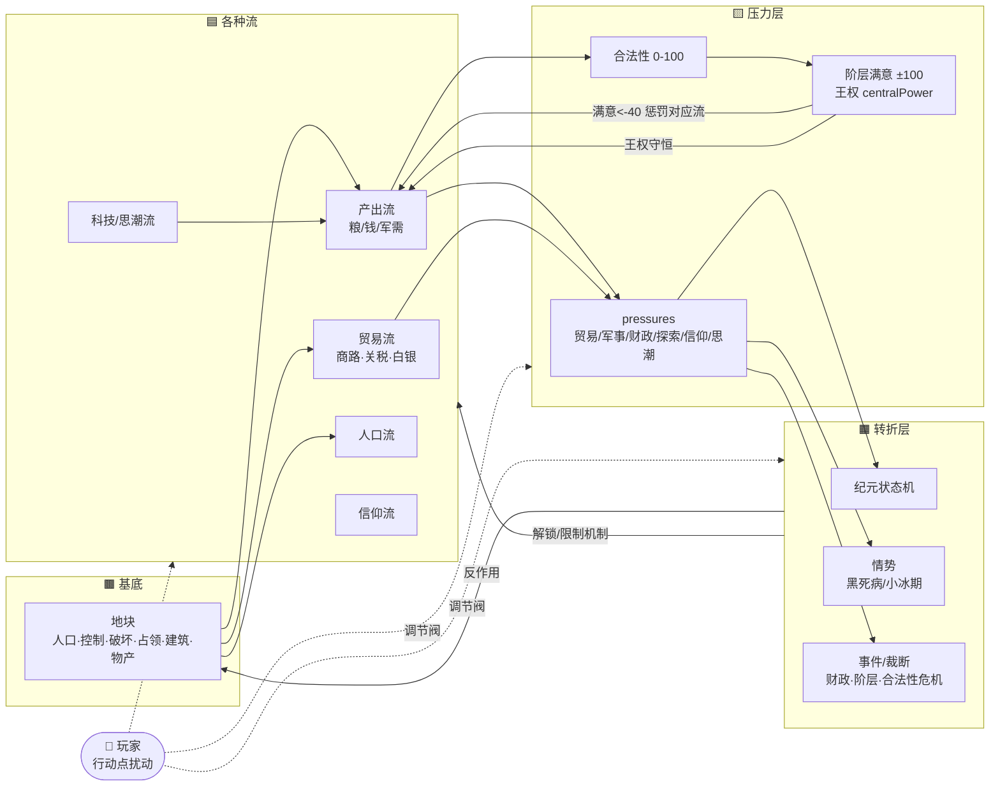
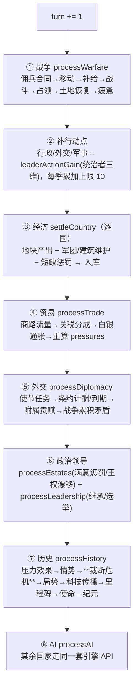
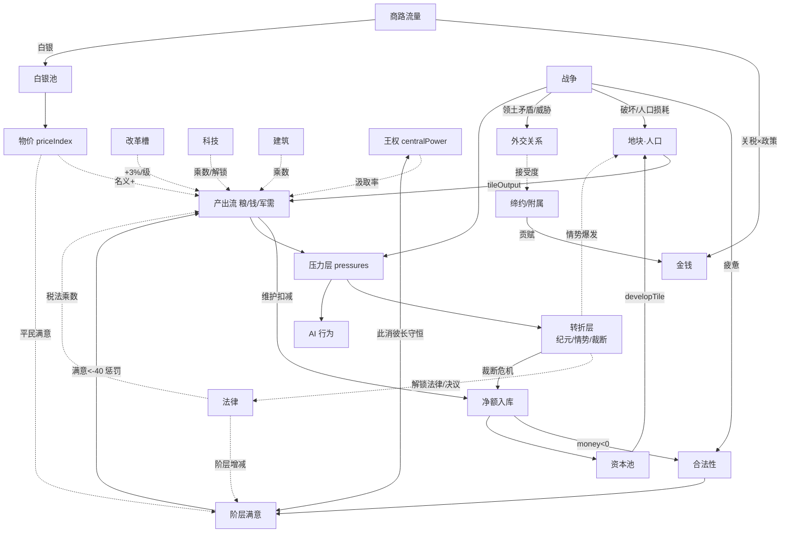

# 35-游戏机制全景图

> 对象：`prototype/hifi` 主线。基于引擎源码全量梳理（politics / economy / diplomacy / warfare / trade / history / struggle / turn）。
> 用途：一张图看懂「玩家能做什么 → 花什么 → 改变了哪条流」，以及世界每季如何自转。
> 编制日期：2026-06-25

## 1. 一句话模型

> **基底（地块·人口·资源）→ 各种流（产出/贸易/人口/科技/信仰）→ 压力层（pressures + 合法性 + 阶层满意）→ 转折层（纪元/情势/事件）→ 反作用回基底 → 循环**

机制（政治/经济/外交/军事/发展）不是循环里的阶段，而是**挂在流上的双向调节阀**：玩家用「行动点」扰动这些阀，世界靠每季 8 步自转把流推下去。**玩家是扰动机器，不是驱动机器。**

## 2. 每季自转的 8 步（`HIFI_TURN_ENGINE.advanceQuarter`）

玩家不点任何键，世界照样推进这 8 步：

## 3. 资源与状态变量速查

| 类别 | 变量 | 范围/单位 | 说明 |
|---|---|---|---|
| **库存资源** | 粮食 food / 金钱 money / 军需 military | 累积量 | 产出流入库的净额；<0 触发短缺惩罚后归零 |
| | 思潮 ideas | 累积量 | 采纳科技的货币；印刷术每季 +3 |
| | 资本 capital | 累积量 | 贸易流的蓄水池，`developTile` 投入基底 |
| **行动点** | 行政 / 外交 / 军事 | 每季累加，上限 10 | 由统治者三维换算；**只 gate 自由动作，不限自动流** |
| **压力层** | 合法性 legitimacy | 0-100 | 短缺/战争疲惫/阶层压它；<55 触发"承压"提示 |
| | 阶层满意 satisfaction | ±100 | <-40 每季惩罚对应资源流；向 0 缓慢回归 |
| | 王权 centralPower | 0-100 | ↔ 阶层权力守恒；决定产出汲取率 + 法律前置 |
| | pressures | 0-100 ×6 | trade/military/fiscal/exploration/faith/ideas，驱动转折与 AI |
| | 物价 priceIndex | ≥1 | 白银流入推高；抬名义金钱产出，但压平民满意 |
| | 战争疲惫 warExhaustion | 累积 | >5 拖累合法性；和平时每季 -2 |
| **基底（地块）** | 人口 / 控制 control / 破坏 devastation / 占领 occupation / 建筑 / 物产 good | — | 产出流的乘数基底 |

## 4. 操作 → 成本 → 影响（全表）

> 「成本」中 **行/外/军** = 行政/外交/军事点。括注资源为库存消耗。免点 = 不耗行动点（属设定开关或自动结算触发）。

### 4.1 政治（行政点为主）— `politics.js`

| 操作 | 成本 | 前置 | 影响（改哪条流/状态） |
|---|---|---|---|
| 颁布法律 setLaw（税收/动员/宗教/权威） | 1 行 | 部分需王权/改革/纪元/宗改 | 阶层满意±、合法性+、王权±；**税法→金钱产出乘数、动员法→征兵人口成本** |
| 召开议会 holdAssembly | 1 行（可 +12 钱收买） | 需议会解锁 | 议会支持=f(平均满意,政改,让步)；过(≥50)→合法性+3；让步特权→阶层权力+2 |
| 推进改革 advanceReform | 行政:10钱 / 军事:10军需 / 政治:4合法性 / 海事:10钱 | 槽<5 | **财政槽→金钱产出+3%/级、军事槽→军需+3%/级、行政槽→整合效率**；解法律/决议前置 |
| 国家决议 enactDecision | 免点（前置极严） | 改革槽/纪元/议会 | 制度跃迁：议会路线/绝对主义/接纳宗改/君主立宪/公民共和 → 改税法+权威+王权 |
| 完成选举 completeElection | 裁断 | pendingElection | 选定新统治者三维 → 改未来行动点产能 |

### 4.2 经济（行政点 + 资源）— `economy.js` / `rules.js`

| 操作 | 成本 | 影响 |
|---|---|---|
| 建造建筑 constructBuilding | 1 行 + 钱（农庄18/市场24/港口28/堡垒30/工坊34） | **产出乘数**：农庄粮×1.35、市场钱×1.4、港口钱×1.25、堡垒军需×1.3、工坊钱军需×1.2 |
| 整合地块 integrateTile | 1 行 + 20 钱 | control +20(+行政改革) → 放大该地块全部产出流 |
| 开发地块 developTile | 1 行 + 30 资本 | 人口 +1 并抬恢复上限 → 扩大产出基底 |
| 采纳科技 adoptTechnology | ideas（30–100） | 年代+传播度≥25 gate；**产出乘数/解锁兵种/解锁商路/通胀链**等 |
| 颁敕令 enactEdict | 强征税:1行→+25钱-2合法 / 建粮储:1行+12钱→+35粮 / 征军需:1军+10钱→+30军需 | 行动点换资源脉冲 |
| 设贸易政策 setTradePolicy | 免点 | closed:本土钱×1.05、对外分成×0.5 ／ open:对外分成×1.3+额外贸易&资本 ／ normal |
| 设国家议程 setAgenda | 免点 | 达成目标阈值 → 合法性奖励 |

### 4.3 发展（流的输入）— 贸易 `trade.js`

| 操作 | 成本 | 影响 |
|---|---|---|
| 投资商路 investRoute | 1 行 + 15 钱 | 路线 boost +15%（上限60%）→ 抬该路线贸易流 |
| 设关税 setTariff | 免点（0/10/25） | 高关税↑分成但↑财政&贸易压力；入 routeCost 抬成本 |
| 自动：贸易流入 | — | 商路流量×关税×政策 → 金钱+资本；白银累积→物价→通胀链 |

### 4.4 外交（外交点为主）— `diplomacy.js`

| 操作 | 成本 | 前置/判定 | 影响 |
|---|---|---|---|
| 缔约 proposeTreaty | 贸易/通行/联姻/互不侵犯 1 外；同盟 2 外 | 接受度≥阈值(50-60) | 占外交容量；同盟→盟友被攻自动参战；贸易→按真实贸易流计酬；联姻→王朝纽带持续抬信任 |
| 索附属 proposeSubject | 朝贡/附庸 2 外、傀儡 3 外 | 接受度≥阈值(48/54/65) | 占容量；每季收贡赋（忠诚<25 则自主漂移=叛离风险）。**P1-1：朝贡威胁权重减半** |
| 调整附属 adjustSubjectControl | 1 外 | 须为宗主 | 收紧：自主-10/贡赋+1 ／ 放宽：忠诚+12/贡赋-1 |
| 派使节 startMission | 1 外（需空闲使节） | — | improve:每季信任+4威胁-2 ／ calm_subject:忠诚+4 |
| 元首外交 performLeaderAction | 1 外 | gift 需20钱 | 赠礼:信任+8友谊+5 ／ 会晤:友谊+7尊重+6 ／ 威慑:威胁+9宿怨+7 |
| 宣战 declareWarOn | 免点（受停战期/已交战限制） | — | 建立战争；真实成本是后续维护+战争疲惫+破坏 |

### 4.5 军事（军事点 + 军需/钱/人口）— `warfare.js`

| 操作 | 成本 | 影响 |
|---|---|---|
| 动员 mobilizeArmy | 1 军 + 步/骑:人口（受动员法乘数）／ 炮:30军需+需火炮科技 | 新军团；人口流转兵力 |
| 雇佣兵 hireMercenary | 40 钱（免点） | 8 季合同，每季工资 20；欠饷掉忠诚→解散 |
| 训练 trainArmy | 1 军 + 10 军需 | 经验+1、组织+15 → 战力 |
| 招将 recruitGeneral | 1 军 | 指挥力=f(军事改革+常备军科技) |
| 补员 reinforceArmy | 军需（20 兵/军需） | 回填缺额 |
| 编制/行军 split/merge/assign/planRoute/demobilize | 免点 | 管理；遣散征召兵→人口回流 |
| 议和 concludePeace | 免点 | 索地(战争分数≥25)/停战 → 20 季停战期 + 解除占领 |
| 自动：战斗/占领/疲惫 | — | 战斗→破坏+人口损耗；占领满→战争分数+25&敌疲惫；疲惫→合法性 |

### 4.6 局势（统一入口，委托给战争/外交）— `struggle.js`

| 决议 | 阶段 | 委托 → 成本 | 影响 |
|---|---|---|---|
| 提王位主张 press_claim | 对峙 | declareWarOn | 开战 |
| 决战集结 muster_battle | 鏖战 | mobilizeArmy（1 军） | 前线集结主力 |
| 有利停战 favorable_truce | 停战 | concludePeace | 索地/维持现状 |
| 选边支持 pick_side | 任意（干涉者） | pickSide | 设阵营倾向 lean |
| 终局决议 ending_decision | 终局 | — | 决定性结局 |
| 自动：战争压力 warPressure | — | — | 累积≥8 且备战→重燃战争（节流） |

### 4.7 裁断 / 事件 — `history.js`（含 P1-2 新增）

| 触发 | 选项 → 影响 | 节流 |
|---|---|---|
| 财政危机（money≤0） | 举债:+45钱-6合法 ／ 增税:+28钱-3合法 ／ 削军费:+12钱-18军需 | 冷却 8 季 + 同时至多 1 个危机挂起 |
| 合法性危机（legitimacy≤10） | 加冕:+16合法-25钱 ／ 大赦:+9合法-8钱 | 同上 |
| 阶层冲突（最不满阶层≤-40） | 让步:+6合法-25钱、该阶层满意+36 ／ 弹压:+3合法-10军需、该阶层-8 | 同上 |
| 黑死病爆发 | 封城:-2合法-10粮 ／ 开市:+12钱-4合法 | 情势节流 |
| 选举 | 选候选人 → 新统治者三维 | pendingElection |

## 5. 流与反馈闭环（机制如何互相喂养）

## 6. 关键反馈回路清单（设计的"活闭环"）

| 回路 | 链路 | 作用 |
|---|---|---|
| **产出—维护取舍** | 扩军/铺建筑 → 维护费回扣产出净额 | 让"什么都不做净增近零"，逼出取舍 |
| **王权守恒** | 王权↑压阶层权力/满意；王权↓阶层坐大 | 集权有代价，放权丢汲取率 |
| **阶层满意惩罚** | 满意<-40 → 惩罚对应流（贵族→军需/商人→钱/教士→合法性/平民→粮） | 政策冲击有后果，逼安抚 |
| **价格革命** | 新大陆白银 → 物价 → 名义金钱↑ + 平民满意↓ | 繁荣与动荡同源 |
| **贸易—本土取舍** | 贸易政策 closed/open 在本土产出与对外分成间取舍 | 开放赚分成、封闭保本土 |
| **资本再投资** | 贸易流 → 资本池 → developTile → 更大基底 | 把流的盈余沉淀回基底 |
| **战争损耗回灌** | 战斗→破坏/人口↓→产出↓；疲惫→合法性↓ | 战争是持续成本，不是一次性 |
| **附属忠诚** | 忠诚<25 → 自主漂移上升（叛离风险） | 宗主需用 calm_subject 维系 |
| **压力→转折→反作用** | pressures 驱动纪元/情势/裁断 → 改基底与可用机制 | 世界随累积压力翻篇 |
| **裁断压力阀（P1-2）** | 钱/合法性/阶层触底 → 必须二选一裁断 → 资源与满意回灌 | 把仪表盘读数变成决策压力 |

---

> 配套阅读：`19`（国家流模型总纲）、`20`（经济/军事/外交/发展深化）、`34`（当前版本优化方案）。
> 空转待激活机制（见 33 号评测）：从属（P1-1 已放宽）、裁断（P1-2 已接入）、建设活性（待 tools/sim 校准）。
