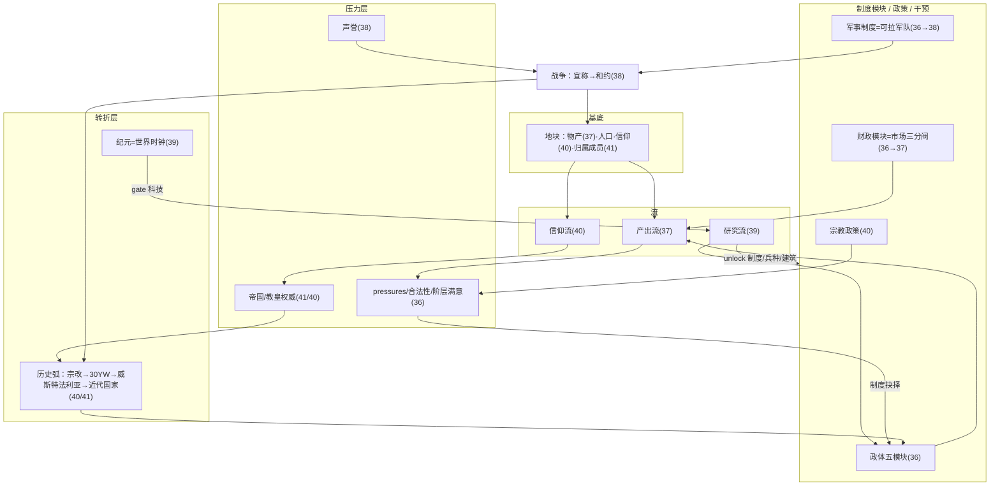
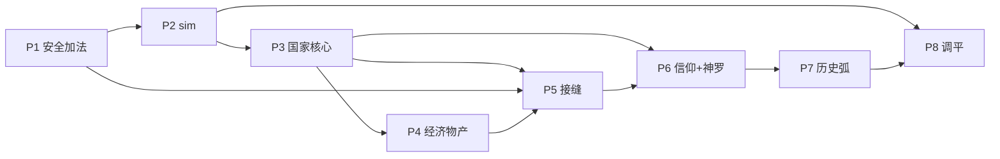

# 42-系统总览 · 交叉审计 · 落地路线图

> 串联 `36`（国家）`37`（经济）`38`（外交军事）`39`（科技）`40`（信仰）`41`（神罗与超国家结构），做一次**交叉审计**（找不协调/空转/缺底座/管道无主），再给**带依赖排序的落地路线图**。
> 日期：2026-06-27

---

# 第一部分 · 一张图串联（36–41 如何咬合成一台机器）

**六个接缝**（机器的关节，审计重点都在这）：
1. 财政模块 = 国家↔经济（36 切分 → 37 市场三分）。
2. 军事制度 = 国家↔军事（36 决定 → 38 可拉军队）。
3. 物产 = 经济↔军事（37 → 38 兵源）。
4. 科技 unlock = 科技↔国家/军事/经济（39 → 36 制度 / 38 兵种 / 37 建筑物产）。
5. 教士耦合 = 信仰↔国家（40 政策 → 36 教士阶层满意）。
6. 历史弧舞台 = 信仰↔神罗（40 弧线 → 41 成员之间上演）。

---

# 第二部分 · 交叉审计（问题清单）

## A. 不协调 / 矛盾（必须解）

### A1. 制度前置：纪元 vs 科技 打架
- `36 §2.2` 把常备军制度的前置写成「纪元=绝对主义 + 货币化财政」；`39` 又说 `standing_drill` 科技 `unlockInstitution: standing_army`。**同一个解锁，两处不同 gate。**
- **解**：以 **39 为准——科技是解锁闸，纪元只 gate 科技的可研年代**。`36` 的制度抉择前置改引「对应使能科技已研」，不再直接写纪元。统一口径：**纪元(何时) → 科技(能不能) → 制度抉择(选不选)**。

### A2. 三个「集权/权威」meter 易混
- 国家 `centralization/王权`(36) · 帝国权威(41) · 教皇/哈里发权威(40/41)。三个不同尺度的轴,名字都像「集权」。
- **解**：明确命名 **王权(国内) / 帝国权威(邦联) / 教权(宗教)**,三轴正交。一个神罗成员**同时有**自己的王权**和**受帝国权威约束——写进 41 §1 原语与 36。

### A3. 兵种「三重门」未统一裁决
- 能不能拉某兵种,受 **军事制度(36)×科技(39)×物产(37)** 三处影响,但没有统一裁决,易过度门控或实现不一致。
- **解**：一条规则——**某兵种需同时满足:制度允许其服役类型 + 科技解锁其兵种 + 有其所需物产**。基础步兵零门槛防早期真空：

| 兵种 | 制度(服役) | 科技 | 物产 |
|---|---|---|---|
| 征召步兵 | 任意 | — | — |
| 骑兵 | 任意 | — | **马** |
| 炮兵 | 任意 | **火药火炮** | **硝石** |
| 职业军 | **常备军制度** | 常备军操典 | — |
| 海军 | — | 远洋帆装/战列舰 | **木材** | ← 见 B1 |

### A4. 「近代国家」转型由 36+39+40 三处驱动
- 绝对/议会/共和的解锁,36(纪元/阶层)、39(启蒙/官僚科技)、40(威斯特法利亚)各说一套。
- **解**:三者是**同一转型的顺序门**,非冗余——**纪元开窗(何时) + 使能科技(能力) + 威斯特法利亚(宗教主权解锁)**。给一份合并规格:组内宗教 CB 关闭、合法性转国家主权、政体走向主权国家,统由「纪元+科技+威斯特法利亚」三门齐发。

## B. 空转 / 缺底座（已核代码，确有缺口）

### B1. 海军：unlock 了一个**不存在的系统** ⚠
- `38` 战列舰、`37` 木材→海军、`39` 远洋帆装,都 unlock「海军」——但 **warfare.js 只有步/骑/炮,根本没有海战/舰队/封锁系统**(已核)。
- **解(要你拍)**:原型阶段**不补完整海战**,改为——远洋帆装/星盘→**探索/殖民/跨洋商路**(37/39 已有);木材→**建造折扣+攻城**(非海军);**战列舰兵种砍掉或标future**;海权用「**贸易航路保护/封锁**」轻量修饰(改 routeCost,不做舰队战)。**是否接受砍掉独立海战?**

### B2. 教产：世俗化要没收的东西**没有底座** ⚠
- `40` 世俗化红利、`37` 教会地产/什一税,都要「没收教会财富」——但**阶层只有 power/satisfaction,没有地产/收入**(已核)。没底座 = 世俗化红利空转。
- **解**:给**教会/教士阶层一个「教会地产」底座**——它控制一组地块(或地块收入的一份额),产出归教会而非王室;**改宗/协约时世俗化将其收归国库 + 土地再分配**(走 36 reconcileEstates)。补进 37/40。

### B3. 资本 capital 偏薄（核实，非红线）
- 由贸易喂、developTile 消耗,有消费方但单薄。**解**:落地时核实它不是 vestigial;若只 developTile 用,考虑并入金钱或加用途(高级建筑/雇佣)。

## C. 跨文档管道需「单一归属」

### C1. 宗教战争管道横跨 38/40/41
- 教皇号召(40)→信徒得 CB(38)→神罗内天主教联盟 vs 新教同盟(41)→30YW 局势(40)。四处接力,易实现成各说各话。
- **解**:**信仰引擎(40)是唯一真相源**(持有 confession/权威/联盟/十字军号召);外交(38)只**读**它出 CB;神罗(41)只是**舞台**。管道写死单一 owner。

### C2. 王朝联姻→继承/共主 × succession 模块 × 神罗选举（欠定义）⚠
- 联姻→宣称(38)、succession 模块(36)、帝国选举(41) 三者交叉,但**共主邦联/继承合并没设计**——而**哈布斯堡靠联姻继承累积王冠**正是近代早期头号机制。
- **解**:需补一个**共主邦联/继承合并**机制(联姻+继承事件对齐 → 两顶王冠归一君,按 succession 模块治理)。**建议单列一个聚焦设计(doc 43?)**,别塞进现有文档。

### C3. 人口模型三处触碰
- 37 processPopulation(增长/饥荒)、36 developTile(抬上限)、warfare(破坏/recoverLand)。
- **解**:**37 processPopulation 单一 owner**;recoverLand 并入;developTile 与战争破坏作为它的输入。(37 已大体说明,确认单一 owner。)

## D. 数据活必须合并

### D1. 三份重铺撞同一份地图种子
- 物产(37 30 种)、信仰(40 两级)、神罗拆国(41 ~20 成员)——**都在重铺 `prototype-map-data.js`**。分三遍 = 三趟过同一份数据。
- **解**:**一次协调数据 pass**——每地块/区域**一并**指派 `{物产, 信仰(组/派), 归属成员}`,且都对历史。一张总表,一趟过。

---

# 第三部分 · 落地路线图（依赖排序）

## 排序五原则
1. **加法先行**:不重写核心循环的纯加法,不卡 sim,先落。
2. **sim 守门**:任何重写产出机器/市场/速率的,排在 `tools/sim` 之后。
3. **接缝待两端**:一条接缝只在两边都就位后接(如「科技→制度」待 36 模块化 + 39 树都在)。
4. **数据一次过**:D1 三合一数据 pass,在消费系统就位时一趟铺完。
5. **神罗拆国待 AI 健壮**:+20 小国前,先确保模块化国家 AI 稳、invariants 覆盖多小国(防重蹈骨架崩溃)。

## 阶段表

| 阶段 | 内容 | 卡 sim? | 解决的审计项 |
|---|---|---|---|
| **P0（已在 branch）** | 评测修复 34 P0-P2 | 否 | — |
| **P1 安全加法** | 36 A/B（id/displayName+派生骨架）· 38 加法（声誉/宣称/战争目标/关系/集团）· 39 结构（树/研究流/扩散/早期奠基技术） | 否 | 落 A1/A2 命名规格 |
| **P2 sim 守门** | 34 P3 `tools/sim`（run/metrics/report/baselines） | — | 后续一切调平的前置 |
| **P3 国家核心** | 36 D–H（王权漂移/法律→模块/产出机器/模块化阶层/制度抉择）；**补教会地产底座(B2)** | **是** | A3(制度侧)·B2 |
| **P4 经济物产** | 37 层1（物产网/人口）可与 P1/P3 叠；层2（市场）卡 sim；**协调数据 pass(D1)** | 层2 是 | A3(物产侧)·C3·D1 |
| **P5 接缝接通** | 36×39（unlockInstitution，定 A1/A4）· 37×38（物产→军队/禁运）· 38×40（圣战 CB，定 C1） | 否 | A1·A4·C1 |
| **P6 信仰+神罗** | 40（两级/信仰流/权威/政策）· 41（原语/拆国/选举/权威/诸侯可扮）；定 **B1 海军决策**、**C2 共主机制** | 部分 | B1·C2 |
| **P7 历史弧** | 宗改→30YW(局势)→威斯特法利亚→近代国家（40/41，定 A4 终态） | — | A4(终态) |
| **P8 数值调平** | 全部速率/平衡（科技速率·转化·世俗化·30YW·强度鸿沟收敛） | **是** | — |

## 依赖 DAG（关键边）

> 关键路径：**P2 sim 是闸**；**P3 国家核心是中枢**（经济/接缝/神罗都依赖它的模块化）；**神罗(P6)依赖国家核心 AI 健壮**；**历史弧(P7)是终局，依赖信仰+神罗+局势引擎全到位**。

## 里程碑

| 里程碑 | 达成标志 |
|---|---|
| M1 可评测基线 | P2 sim 跑通，34/35 报告可一键重生 |
| M2 模块化国家上线 | P3：政体涌现、王权漂移、制度抉择，invariants 5×200 绿 |
| M3 活的经济 | P4：30 物产分化、市场三分、建设激活，sim 强度鸿沟开始收窄 |
| M4 涌现的外交军事 | P5：宣称/战争目标/声誉/集团成环 |
| M5 信仰与神罗 | P6：两级宗教、教皇/帝国权威、神罗 20 成员可扮 |
| M6 历史弧兑现 | P7：长局能跑出 宗改→30YW→威斯特法利亚→近代国家 |
| M7 调平收口 | P8：5 原型强度落健康带，无碾压 |

---

# 第四部分 · 需要你拍的两个 scope 决策

1. **B1 海军**：接受「不补完整海战，远洋技术/木材改喂探索/商路/攻城，砍独立战列舰」？还是要做轻量海战？
2. **C2 共主继承**：补一个聚焦的「共主邦联/继承合并」设计（doc 43）来承载哈布斯堡式联姻继承？还是先简化（联姻只给关系/宣称，不做王冠合并）？

其余审计项（A1–A4、B2、C1、C3、D1）我已给出明确解法，按上表在对应阶段落实即可。

---

> 配套：`34`（sim=P2）、`35`（全景图）、`36–41`（六系统）。本文是它们的**装配说明书**。
