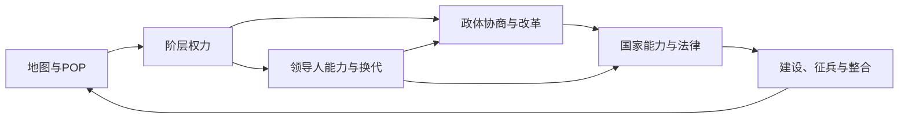

# 开发日志 03 - 国家、领导人、政体与阶层

大家好，今天聊国家内部。

在《帝国的代价》里，国家不是地图上的一片颜色，也不是国王个人意志的延伸。它是由领导人、制度、阶层、法律和地方利益共同推动的一台政治机器。

我们的目标很直接：

**让玩家能够命令国家，但不能假装国家内部没有其他人。**

## 1337 年的国家并不现代

1337 年的欧洲、北非和地中海世界，还不存在后来那种边界清晰、制度统一、命令可以直接传到每个地区的现代国家。

法兰西国王需要面对大封臣和等级会议；英格兰王权依赖议会、贵族和地方征税；威尼斯由商人寡头选出总督；神圣罗马帝国的皇帝必须同诸侯、城市和教会反复协商；金帐汗国的权力则建立在汗族、部落和军事联盟之上。

| 历史结构 | 游戏中的问题 |
|---|---|
| 王权依赖贵族军役 | 国王能否绕过贵族征兵和征税 |
| 城市与商人积累财富 | 市场繁荣是否会制造强势商业阶层 |
| 教会拥有土地和司法权 | 宗教合法性与国家改革如何冲突 |
| 帝国由不同领地组成 | 皇帝能否把名义权威变成实际控制 |
| 共和国由派系协商治理 | 高效商业制度会不会走向寡头统治 |
| 边疆依赖地方军事集团 | 扩张是否会制造难以控制的总督和氏族 |

因此，国家内部不能只用一个“稳定度”数值概括。

玩家面对的不是抽象的不满，而是具体的权力集团：他们来自哪些地块、控制哪些人口、依靠哪些建筑，又希望国家朝什么方向发展。

## 玩家不是国王

第一篇开发日志中，我们提到玩家扮演的是国家背后的长期统治集团，而不是某个具体人物。

加入领导人系统后，这一点仍然没有改变。

国王会死亡，总督会卸任，皇帝可能被废黜，教皇和大团长会由新的选举产生。玩家继续控制国家，但国家每个时期的行动能力、合法性和政治空间都会受到当前领导人的影响。

| 玩家代表 | 领导人代表 |
|---|---|
| 国家长期战略意志 | 当前时代的统治者 |
| 跨越数代的目标 | 一段具体任期 |
| 决定国家向哪里发展 | 决定国家能多快执行 |
| 承担制度的长期后果 | 带来个人能力和换代风险 |

这意味着优秀的统治者不会替玩家作出正确决定，但能给玩家更多做决定的机会。

平庸的统治者也不会直接让游戏失败。他会让你发现，过去一个春天能够同时推动建设和整合，现在可能只能完成其中一件。

## 领导人

第一版为地图上的每个可玩国家配置了 1337 年的历史领导人。

法兰西由腓力六世统治，英格兰由爱德华三世统治，威尼斯的总督是弗朗切斯科·丹多洛，教皇国由本笃十二世领导，奥斯曼贝伊国则处在奥尔汗的统治之下。

不同政体拥有不同的领导人头衔和换代规则。

| 政权类型 | 领导人例子 | 常见换代 |
|---|---|---|
| 君主国 | 国王、公爵、伯爵、苏丹、贝伊 | 世袭、死亡、退位、政变 |
| 帝国 | 皇帝、大汗 | 继承、推举、废黜 |
| 商业共和国 | 总督 | 定期选举或终身选举 |
| 共和国 | 执政官、王公、市长 | 定期选举 |
| 神权国 | 教皇、大团长 | 终身选举 |
| 部族联盟 | 大汗、盟主 | 家族继承与部族推举 |

丹麦在 1337 年仍处于无王期，因此开局领导人不是一位虚构国王，而是实际掌握主要权力的格哈德三世。类似的特殊政治状态会尽量通过具体领导人与制度来表现，而不是被统一模板抹平。

### 三项能力

每位领导人拥有行政、外交和军事三项能力，范围为 0 至 6。

| 能力 | 影响 | 典型用途 |
|---|---|---|
| 行政 | 每季获得的行政点 | 建设、道路、官员、整合、行政改革 |
| 外交 | 每季获得的外交点 | 议会协商、政治改革，以及后续外交与贸易 |
| 军事 | 每季获得的军事点 | 征兵、移动、军事改革和战争 |

每季获得的对应行动点为：

`1 + 向下取整（能力 ÷ 2）`

行动点可以积累，但单项上限为 10。

这个上限让玩家能够为大型改革或战争做准备，却不能无限囤积一位杰出领导人的能力。

## 时间与换代

游戏从 1337 年春开始，一个回合代表一个季节：

**春 → 夏 → 秋 → 冬 → 下一年春**

领导人的年龄、任期、历史换代和动态事件都随季节推进。

换代采用历史与动态模拟混合的方式。

| 情况           | 系统处理             |
| ------------ | ---------------- |
| 历史正常推进       | 优先出现真实历史继任者      |
| 君主正常继承       | 继承人优先延续原家族       |
| 领导人高龄        | 可能在历史节点前去世       |
| 国家合法性与中央权力过低 | 可能发生政变           |
| 定期选举任期结束     | 产生三名候选人          |
| 终身选举领导人去世    | 召开新的选举           |
| 历史人物名单耗尽     | 按文化、家族和政体继续生成继任者 |

历史提供的是初始轨道，不是无法改变的剧本。

如果国家没有发生重大偏离，真实继任人会优先进入继承或选举流程。但战争、政治崩溃、政体改革和提前死亡都可能让历史转向另一条道路。

共和国和其他选举政体不会简单地让历史继任者自动上台。真实人物会成为候选人之一，玩家仍需在三名候选人中作出选择。

| 候选人信息 | 玩家需要判断 |
|---|---|
| 行政、外交、军事能力 | 下一任期国家擅长什么 |
| 家族 | 哪个政治集团会获得地位 |
| 支持阶层 | 选举结果会强化谁 |
| 任期 | 这项选择会持续多久 |

其他国家也会进行自己的换代。AI 会综合候选人能力、支持阶层的权力和满意度作出选择。

这为未来的外交系统留下了一个重要入口：你面对的不只是“法兰西王国”，也会面对当时具体的国王、摄政者、总督或皇帝。

## 政体不是加成包

政体决定国家权力从哪里来，也决定谁有资格阻止玩家。

| 政体 | 核心权力 | 政治机构 | 主要优势 | 主要风险 |
|---|---|---|---|---|
| 君主制 | 王权 | 等级会议 | 合法性和军事动员 | 贵族特权、继承危机 |
| 共和国 | 议会权威 | 议会 | 城市、财政和协商 | 派系斗争、战争授权 |
| 神权国 | 教权 | 教义会议 | 宗教整合和合法性 | 宽容低、改革受阻 |
| 部族联盟 | 盟约权威 | 部族大会 | 动员快、边疆适应强 | 财政弱、氏族分裂 |
| 商业共和国 | 商贸权威 | 商人议会 | 港口、市场和舰队 | 寡头化、内陆控制弱 |
| 帝国制 | 帝国权威 | 帝国会议 | 大国整合和威望 | 诸侯割据、宫廷危机 |

同一个数值，在不同政体里表达的不是同一种东西。

君主制的王权高，意味着国王可以更快改法、征税和整合地方，但贵族会认为传统权利受到侵犯。共和国的议会权威高，意味着议案能够更快执行，但失势派系可能转向抵制。帝国权威高，可以压制诸侯和边疆总督，也会把越来越多矛盾集中到宫廷。

**强权不会消灭政治，它只会改变政治冲突发生的位置。**

## 改革、法律与政体转型

国家拥有行政、财政、军事、宗教、政治和海洋六类改革槽。

改革不是永久加成列表，而是国家未来可以走向哪里的条件。

| 改革 | 直接作用 | 政治代价 |
|---|---|---|
| 行政改革 | 控制力和整合能力提高 | 地方贵族与自治集团受损 |
| 财政改革 | 税收和市场收益提高 | 商人权力上升 |
| 军事改革 | 征兵和军需体系增强 | 贵族或平民承担成本 |
| 宗教改革 | 合法性和宗教治理改变 | 教会权力重新分配 |
| 政治改革 | 解锁议会和政体路线 | 旧制度集团反弹 |
| 海洋改革 | 港口、舰队和远贸增强 | 商社与港口寡头坐大 |

政体不能通过按钮免费切换。

君主制若要走向君主立宪，需要先召开等级会议，让商人和平民获得足够政治力量；若要建立共和国，则必须让议会真正有能力取代王权。部族联盟转向封建君主制，需要定居地和行政改革。商业共和国想成为海洋帝国，则必须先建立足够强大的港口与舰队网络。

政体变化后，领导人制度也会变化。

国王建立共和国后不会继续以世袭国王身份统治。他将转为执政官式领导人，并进入任期和选举体系。反过来，共和国若在危机中拥立君主，也会重新建立世袭和王权结构。

## 阶层从地图上生长

阶层不是四条凭空变化的进度条。

他们的力量来自地图。

| 地图基础 | 可能强化的阶层 |
|---|---|
| 贵族庄园、要塞、骑士人口 | 贵族、军事派、诸侯 |
| 市场、港口、市民 POP | 商人、行会、商社 |
| 教堂、修道院、教士 POP | 教会、修会、教士 |
| 农田、农民 POP、自由农社 | 平民、农民、信众 |
| 边疆、草原、部族营地 | 氏族、战士、牧民 |
| 征服地与总督府 | 边疆总督、地方军政集团 |

不同政体会用不同方式组织这些社会力量。

| 政体 | 主要阶层 |
|---|---|
| 君主制 | 贵族、商人、教会、平民、王室官僚 |
| 共和国 | 贵族派、市民派、行会、平民、议长派系 |
| 神权国 | 教士、修会、贵族、信众、圣座使节 |
| 部族联盟 | 氏族、战士、祭司、牧民、盟主亲族 |
| 商业共和国 | 商社、行会、港口贵族、水手平民、寡头家族 |
| 帝国制 | 宫廷、诸侯、帝国教会、城市、边疆总督 |

每个阶层拥有权力、满意度和特权。

权力决定他们能多大程度推动或阻止国家行动；满意度决定他们是否愿意合作；特权则是玩家过去为了换取支持而留下的长期承诺。

## 玩家会付出什么

政治系统的核心不是“把所有阶层哄开心”。

这是做不到的。

| 玩家行动 | 直接收益 | 谁可能受益 | 谁可能反对 |
|---|---|---|---|
| 建设市场 | 金钱和市场接入提高 | 商人、行会、商社 | 平民、旧贵族 |
| 建设要塞 | 防御和控制力提高 | 贵族、军事派 | 财政集团、农民 |
| 推动中央集权 | 国家执行力提高 | 官僚、宫廷 | 贵族、诸侯、地方氏族 |
| 扩大议会 | 改革更稳定 | 商人、市民、平民 | 王室、宫廷、传统贵族 |
| 征兵 | 军队增加 | 军事阶层 | 农民、牧民和城市生产者 |
| 宗教统一 | 合法性提高 | 教会、教士 | 异教地区和宽容派 |

一个富裕的港口网络会让国家拥有更多金钱，也会让商社获得要求政治回报的力量。大规模要塞建设能够稳定边疆，也可能让地方贵族和总督真正掌握军队。依靠教会维持合法性的国家，在推动宗教宽容时会付出更高代价。

你可以压制一个阶层，但不能让他们控制的土地、人口和建筑凭空消失。

## 四个系统如何连在一起

国家、领导人、政体和阶层不是四个平行面板。

它们组成一条循环：

领导人的能力决定国家每个季节拥有多少行动空间。政体决定这些行动是否需要议会、会议或阶层授权。阶层的力量来自地图，并会因玩家的建设、征兵和改革继续变化。

因此，一位行政能力很高的国王，也不能在贵族掌握大量庄园和要塞时无代价地完成集权。一位外交能力优秀的总督，可以更频繁地推动议会与贸易政策，但他也可能依靠商社支持，把共和国推向寡头化。

人物影响制度，制度约束人物，地图为两者提供实际力量。

## 当前原型

国家政治模块已经进入可操作原型。

| 特性 | 状态 |
|---|---|
| 各国独立国家状态 | 已完成原型 |
| 1337 年历史领导人、家族和头衔 | 已完成首批配置 |
| 春、夏、秋、冬时间推进 | 已完成原型 |
| 行政、外交、军事三类行动点 | 已完成原型 |
| 历史继承与动态换代 | 已完成原型 |
| 定期和终身选举 | 已完成原型 |
| 三名候选人选择 | 已完成原型 |
| 六类政体及对应核心权力 | 已完成原型 |
| 改革槽、法律、议会与决议 | 已完成基础原型 |
| 政体特色阶层 | 已完成基础原型 |
| 地块主导阶层和地产 | 已接入地图数据 |
| 外国领导人查看 | 已完成原型 |
| 完整外交人物互动 | 后续开发 |

当前领导人数据库仍会继续校准。能力值属于玩法评价，不是对历史人物的绝对结论；部分政治结构复杂的地区，也需要随着地图和国家拆分继续细化。

阶层系统接下来还需要补充更完整的诉求、特权、叛乱和地方自治机制，让玩家看到的不只是满意度变化，而是他们在地图上真正采取行动。

## 本篇结论

国家政治模块的设计原则是：

**领导人决定国家一时能做多少，政体决定权力如何运作，阶层决定每项决定最终由谁付出代价。**

下一篇开发日志会讲外交：国家之间的关系为什么不只是一条好感度，以及领导人、贸易、战争目标和国内阶层将如何影响对外政策。
